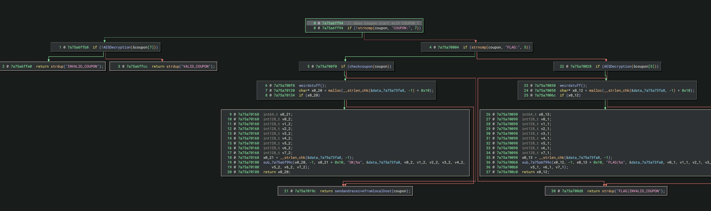

# Reading

https://github.com/rscloura/Doldrums
https://blog.tst.sh/reverse-engineering-flutter-apps-part-1
https://www.guardsquare.com/blog/current-state-and-future-of-reversing-flutter-apps

# flutter

with `libnative.so` which does some flag magic. we can find the exports in `libapp.so`

# libnative.so

```bash
❯ nm -D libnative.so | grep "T"
0000000000002934 T buffer_manager
00000000000028d4 T buf_util
0000000000002978 T config_loader
00000000000028e4 T data_helper
0000000000002988 T force_data_preservation
00000000000024e0 T get_client_version
0000000000002694 T hidden_decrypt_function
00000000000024ec T hidden_encode_function
00000000000025b4 T hidden_log_function
0000000000001f6c T process_data_complete
0000000000002a9c T test_all_functions
0000000000002768 T util_func_a
00000000000027bc T util_func_b
0000000000002810 T util_func_c
00000000000028c8 T util_func_d
000000000000297c T version_info
```

```
>  frida-trace -UN dk.brunnerne.masterbaker -i 'libnative.so!*'
Started tracing 16 functions. Web UI available at http://localhost:61491/
           /* TID 0x228c */
 10282 ms  process_data_complete(COUPON:thisisthecoupon)
```



1. Let's test what happens when the functions return `VALID_TOKEN`
```
defineHandler({
  onEnter(log, args, state) {
    log(`process_data_complete(${args[0].readCString()})`);
  },

  onLeave(log, retval, state) {
    retval.replace(Memory.allocUtf8String("VALID_TOKEN"));
  }
});
```

Mhhhh, now we are getting a completly new input to the function

```
153592 ms  process_data_complete(COUPON:test2)
155898 ms  process_data_complete({"customer":{"name":"test1","timestamp":1756072657835},"order":{"items":[{"name":"Brunsviger Slice","price":25,"quantity":1,"total":25},{"name":"Cinnamon Roll","price":20,"quantity":1,"total":20},{"name":"Rye Bread Loaf","price":30,"quantity":1,"total":30}],"total":75,"note":"test3"},"metadata":{"app_version":"1.0.0","platform":"android","client_version":"network_client v1.0"}})
```

If we change it to `FLAG|INVALID_COUPON`, I observe this:

```js
 17221 ms  process_data_complete(COUPON:asd)
 19186 ms  process_data_complete(COUPON:asd)
 20022 ms  process_data_complete(COUPON:asd)
 23029 ms  process_data_complete(COUPON:asd)
 25772 ms  get_client_version()
 25772 ms  process_data_complete({"customer":{"name":"test","timestamp":1756073300857},"order":{"items":[{"name":"Cinnamon Roll","price":20,"quantity":1,"total":20}],"total":20,"note":"ges"},"metadata":{"app_version":"1.0.0","platform":"android","client_version":"network_client v1.0"}})
 ```