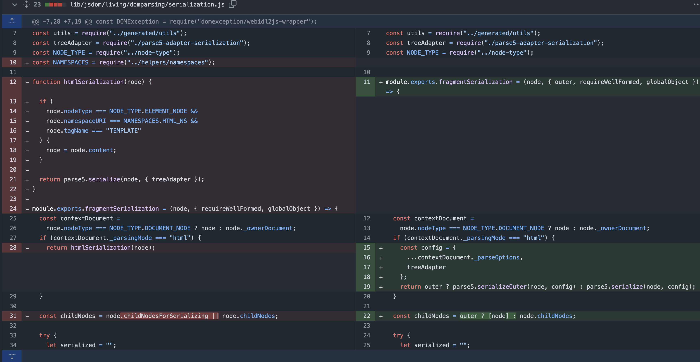

https://github.com/cure53/DOMPurify/commit/a4d33f3fddad3e8ba48cc82fe7243a6fa67d7ce3#diff-b335630551682c19a781afebcf4d07bf978fb1f8ac04c6bf87428ed5106870f5R3-R62

```
Running DOMPurify on the server requires a DOM to be present, which is probably no surprise. Usually, [jsdom](https://github.com/jsdom/jsdom) is the tool of choice and we **strongly recommend** to use the latest version of _jsdom_.

Why? Because older versions of _jsdom_ are known to be buggy in ways that result in XSS _even if_ DOMPurify does everything 100% correctly. There are **known attack vectors** in, e.g. _jsdom v19.0.0_ that are fixed in _jsdom v20.0.0_ - and we really recommend to keep _jsdom_ up to date because of that.
```

https://github.com/opensearch-project/reporting-cli/issues/49

https://www.tenable.com/security/research/tra-2021-05


https://github.com/jsdom/jsdom/compare/19.0.0...20.0.0



https://github.com/jsdom/jsdom/commit/2e355263e5cae2e4647b0956f777c0abd2c62d5b

https://stackoverflow.com/questions/46941911/javascript-innerhtml-vs-outerhtml