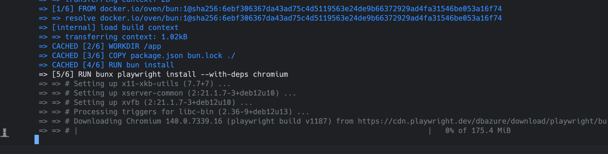

flagge.html
        

            
<strong>Benutzername:</strong> {{{benutzername}}} (voll der coole Name!)

            
<strong>Submittete Flagge:</strong> {{{flagge}}}

            
<strong>Submission Zeit:</strong> {{{aktuelleZeit}}} (genau dokumentiert, wie es sich gehört!)

        

ENV DEBUG=pw:api,pw:browser*

