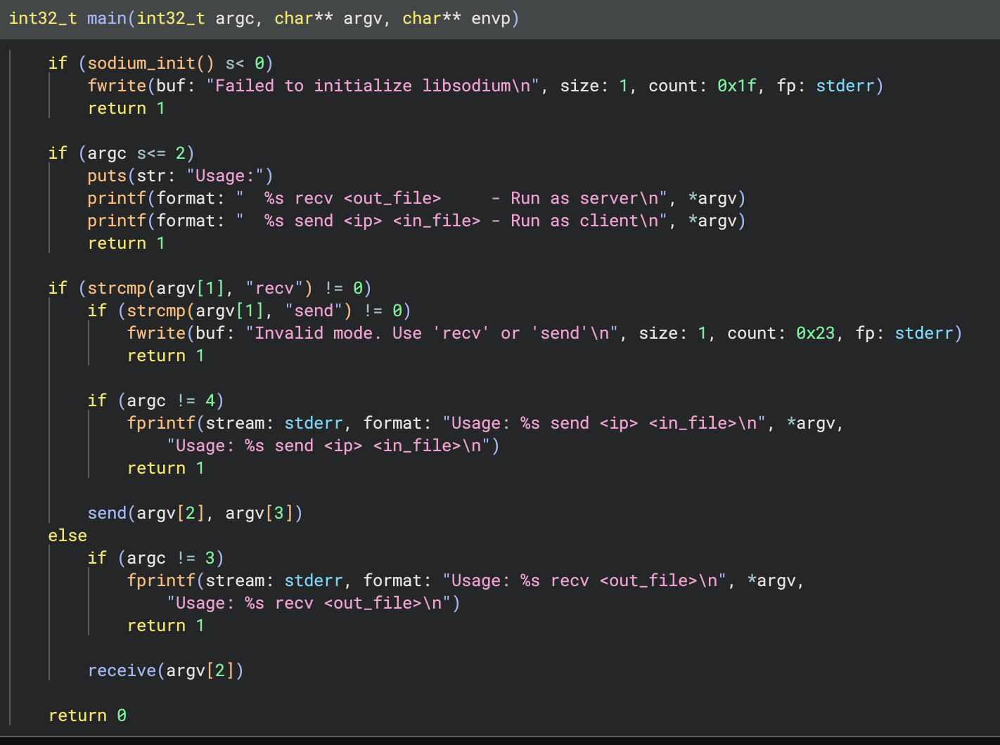
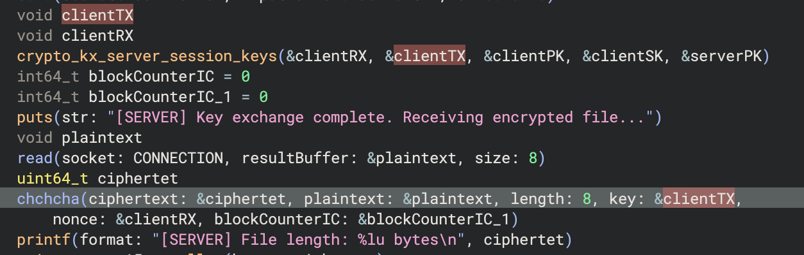
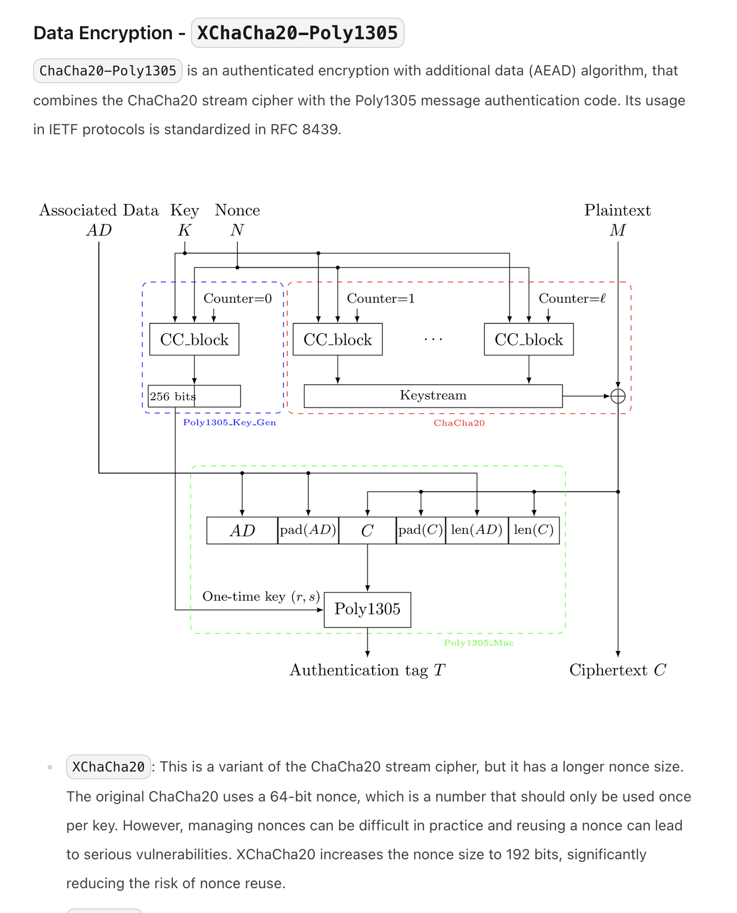
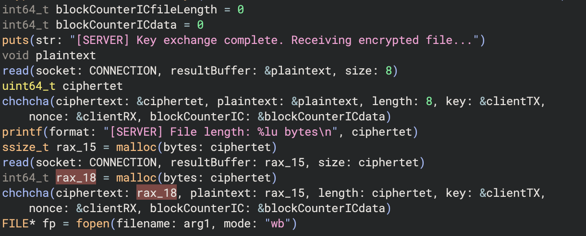
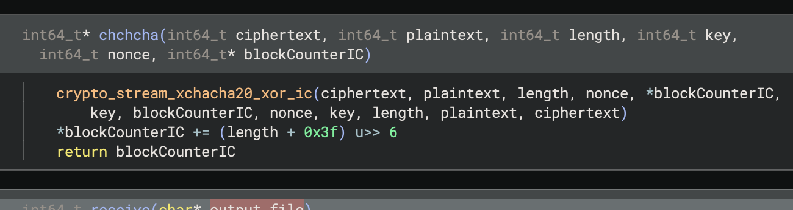

```sh
capture.pcap: pcap capture file, microsecond ts (little-endian) - version 2.4 (Ethernet, capture length 262144)
sft:          ELF 64-bit LSB pie executable, x86-64, version 1 (SYSV), dynamically linked, interpreter /lib64/ld-linux-x86-64.so.2, BuildID[sha1]=641cc85489a1770ebb74258a4f16ebd1101d503d, for GNU/Linux 3.2.0, stripped
```

```sh
❯ tshark -r capture.pcap -q -z endpoints,ip
================================================================================
IPv4 Endpoints
Filter:<No Filter>
                       |  Packets  | |  Bytes  | | Tx Packets | | Tx Bytes | | Rx Packets | | Rx Bytes |
51.15.211.189                 55         88151         30           44245          25           43906   
51.158.179.166                55         88151         25           43906          30           44245   
================================================================================
```

It is one tcp stream. Saved as yaml so we can ready it with python.




```c
int crypto_kx_keypair(unsigned char pk[crypto_kx_PUBLICKEYBYTES],
                      unsigned char sk[crypto_kx_SECRETKEYBYTES]);

/*
The crypto_kx_keypair() function creates a new key pair. It puts the public key into pk and the secret key into sk.
*/

int crypto_kx_server_session_keys(unsigned char rx[crypto_kx_SESSIONKEYBYTES],
                                  unsigned char tx[crypto_kx_SESSIONKEYBYTES],
                                  const unsigned char server_pk[crypto_kx_PUBLICKEYBYTES],
                                  const unsigned char server_sk[crypto_kx_SECRETKEYBYTES],
                                  const unsigned char client_pk[crypto_kx_PUBLICKEYBYTES]);

/*
The crypto_kx_server_session_keys() function computes a pair of shared keys (rx and tx) using the server’s public key server_pk, the server’s secret key server_sk, and the client’s public key client_pk.

It returns 0 on success and -1 if the client’s public key is not acceptable.

The shared secret key rx should be used by the server to receive data from the client, whereas tx should be used for data flowing in the opposite direction.

rx and tx are both crypto_kx_SESSIONKEYBYTES bytes long. If only one session key is required, either rx or tx can be set to NULL.
*/

int crypto_stream_xchacha20_xor_ic(unsigned char *c, const unsigned char *m,
                                   unsigned long long mlen,
                                   const unsigned char *n, uint64_t ic,
                                   const unsigned char *k);

/*
The crypto_stream_xchacha20_xor_ic() function is similar to crypto_stream_xchacha20_xor() but adds the ability to set the initial value of the block counter to a non-zero value, ic.

This permits direct access to any block without having to compute the previous ones.

m and c can point to the same address (in-place encryption/decryption). If they don’t, the regions should not overlap.
*/
```



> The crypto_kx_server_session_keys() function computes a pair of shared keys (rx and tx) using the server’s public key server_pk, the server’s secret key server_sk, and the client’s public key client_pk.

Therefore, the session key is `clientTX`. Furthermore, the keys are used as a nonce! 



> Unlike plain ChaCha20, the nonce is 192 bits long, so that generating a random nonce for every message is safe. If the output of the PRNG is indistinguishable from random data, the probability for a collision to happen is negligible.

How long are all those keys??? 

> The shared secret key rx should be used by the server to receive data from the client, whereas tx should be used for data flowing in the opposite direction.

However, we are in `receive` so this is the first puzzle piece.



I also notice that the `IC` is 0 which seems to be the default anyways.

# Xchacha nonce reuse

https://datatracker.ietf.org/doc/html/draft-irtf-cfrg-xchacha-03#section-2.3

```
2.3.  XChaCha20

   XChaCha20 can be constructed from an existing ChaCha20 implementation
   and HChaCha20.  All one needs to do is:

   1.  Pass the key and the first 16 bytes of the 24-byte nonce to
       HChaCha20 to obtain the subkey.

   2.  Use the subkey and remaining 8 byte nonce with ChaCha20 as normal
       (prefixed by 4 NUL bytes, since [RFC8439] specifies a 12-byte
       nonce).

   XChaCha20 is a stream cipher and offers no integrity guarantees
   without being combined with a MAC algorithm (e.g.  Poly1305).

   The same HChaCha20 subkey derivation can also be used in the context
   of an AEAD_ChaCha20_Poly1305 implementation to create
   AEAD_XChaCha20_Poly1305, as described in Section 2.  Note that, with
   the AEAD mode, the initial block counter is set to 1 instead of 0,
   since the first block is used to derive the one-time Poly1305 key.
```

This seems deadly as I jsut need to xor two data stream lol...

If we look closely at the chacha implementation, we notice that the block counter is always increased in a special way



According to chatty

```
(length + 0x3f) >> 6 = ceil(length / 64) → number of 64-byte blocks touched.
So after encrypting length bytes starting at the given block counter, the code advances the counter by the number of blocks consumed. That’s exactly what you want for a streaming API.
```

This means that the block counter is increased which is kinda mhhh