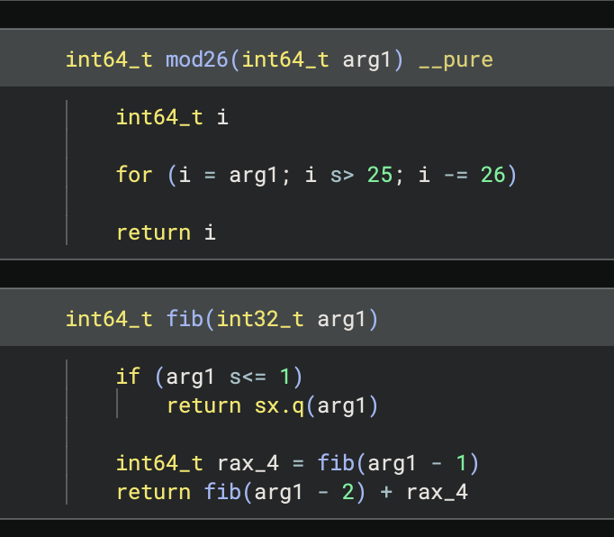

docker run --security-opt seccomp:unconfined -it <image name> /bin/bash

❯ docker run --security-opt seccomp:unconfined -v "$PWD:/data" -it 1c48965c5eed /bin/bash

❯ docker run --platform linux/amd64 --security-opt seccomp:unconfined -v "$PWD:/data" -p 27042:27042 -it debian:bullseye /bin/bash -c "cd /data && chmod u+x frida-server-17.2.11-linux-x86_64 && ./frida-server-17.2.11-linux-x86_64"

root@cd0b4859a934:/data# uname -a
Linux cd0b4859a934 6.12.13-arm64 #1 SMP Kali 6.12.13-1kali1 (2025-02-11) x86_64 x86_64 x86_64 GNU/Linux


# Setup UTM QEMU based amd64 kali 

┌──(.venv)─(kali㉿kali)-[~/Documents]
└─$ frida -f challange.out
     ____
    / _  |   Frida 17.2.11 - A world-class dynamic instrumentation toolkit
   | (_| |
    > _  |   Commands:
   /_/ |_|       help      -> Displays the help system
   . . . .       object?   -> Display information about 'object'
   . . . .       exit/quit -> Exit
   . . . .
   . . . .   More info at https://frida.re/docs/home/
   . . . .
   . . . .   Connected to Local System (id=local)
Spawned `challange.out`. Resuming main thread!                          
CTF{IX[Local::challange.out ]->
[Local::challange.out ]->
[Loc[Local::challange.out ]->
[Local::challange.out ]-> Process.enumerateModules();
[
    {
        "base": "0x5558cc150000",
        "name": "challange.out",
        "path": "/home/kali/Documents/challange.out",
        "size": 16440
    },
    {
        "base": "0x7f92b7667000",
        "name": "linux-vdso.so.1",
        "path": "linux-vdso.so.1",
        "size": 5903
    },
    {
        "base": "0x7f92b7442000",
        "name": "libc.so.6",
        "path": "/usr/lib/x86_64-linux-gnu/libc.so.6",
        "size": 2055800
    },
    {
        "base": "0x7f92b7669000",
        "name": "ld-linux-x86-64.so.2",
        "path": "/usr/lib/x86_64-linux-gnu/ld-linux-x86-64.so.2",
        "size": 226064
    },
    {
        "base": "0x7f92b543f000",
        "name": "libdl.so.2",
        "path": "/usr/lib/x86_64-linux-gnu/libdl.so.2",
        "size": 16400
    },
    {
        "base": "0x7f92b543a000",
        "name": "librt.so.1",
        "path": "/usr/lib/x86_64-linux-gnu/librt.so.1",
        "size": 16400
    },
    {
        "base": "0x7f92b534a000",
        "name": "libm.so.6",
        "path": "/usr/lib/x86_64-linux-gnu/libm.so.6",
        "size": 978968
    },
    {
        "base": "0x7f92b5345000",
        "name": "libpthread.so.0",
        "path": "/usr/lib/x86_64-linux-gnu/libpthread.so.0",
        "size": 16400
    }
]
[[Local::challange.out ]->
[Local::challange.out ]-> Process.getModuleByName("challange.out");
{
    "base": "0x5558cc150000",
    "name": "challange.out",
    "path": "/home/kali/Documents/challange.out",
    "size": 16440
}
[Local::challange.out ]-> var main = Process.getModuleByName("challange.out");
[Local::challange.out ]-> main
{
    "base": "0x5558cc150000",
    "name": "challange.out",
    "path": "/home/kali/Documents/challange.out",
    "size": 16440
}
[Local::challange.out ]-> main.enumerateExports();
[
    {
        "address": "0x5558cc154028",
        "name": "stdout",
        "type": "variable"
    }
]
[Local::challange.out ]-> main.enumerateSymbols
function
[Local::challange.out ]-> main.enumerateSymbols();
[
    {
        "address": "0x0",
        "isGlobal": false,
        "name": "",
        "size": 0,
        "type": "unknown"
    },
    {
        "address": "0x0",
        "isGlobal": false,
        "name": "Scrt1.o",
        "size": 0,
        "type": "file"
    },
    {
        "address": "0x5558cc15037c",
        "isGlobal": false,
        "name": "__abi_tag",
        "section": {
            "id": "4.note.ABI-tag",
            "protection": "r--"
        },
        "size": 32,
        "type": "object"
    },
    {
        "address": "0x0",
        "isGlobal": false,
        "name": "crtstuff.c",
        "size": 0,
        "type": "file"
    },
    {
        "address": "0x5558cc1510a0",
        "isGlobal": false,
        "name": "deregister_tm_clones",
        "section": {
            "id": "15.text",
            "protection": "r-x"
        },
        "size": 0,
        "type": "function"
    },
    {
        "address": "0x5558cc1510d0",
        "isGlobal": false,
        "name": "register_tm_clones",
        "section": {
            "id": "15.text",
            "protection": "r-x"
        },
        "size": 0,
        "type": "function"
    },
    {
        "address": "0x5558cc151110",
        "isGlobal": false,
        "name": "__do_global_dtors_aux",
        "section": {
            "id": "15.text",
            "protection": "r-x"
        },
        "size": 0,
        "type": "function"
    },
    {
        "address": "0x5558cc154030",
        "isGlobal": false,
        "name": "completed.0",
        "section": {
            "id": "26.bss",
            "protection": "rw-"
        },
        "size": 1,
        "type": "object"
    },
    {
        "address": "0x5558cc153dd8",
        "isGlobal": false,
        "name": "__do_global_dtors_aux_fini_array_entry",
        "section": {
            "id": "21.fini_array",
            "protection": "rw-"
        },
        "size": 0,
        "type": "object"
    },
    {
        "address": "0x5558cc151150",
        "isGlobal": false,
        "name": "frame_dummy",
        "section": {
            "id": "15.text",
            "protection": "r-x"
        },
        "size": 0,
        "type": "function"
    },
    {
        "address": "0x5558cc153dd0",
        "isGlobal": false,
        "name": "__frame_dummy_init_array_entry",
        "section": {
            "id": "20.init_array",
            "protection": "rw-"
        },
        "size": 0,
        "type": "object"
    },
    {
        "address": "0x0",
        "isGlobal": false,
        "name": "challange.c",
        "size": 0,
        "type": "file"
    },
    {
        "address": "0x0",
        "isGlobal": false,
        "name": "crtstuff.c",
        "size": 0,
        "type": "file"
    },
    {
        "address": "0x5558cc152134",
        "isGlobal": false,
        "name": "__FRAME_END__",
        "section": {
            "id": "19.eh_frame",
            "protection": "r--"
        },
        "size": 0,
        "type": "object"
    },
    {
        "address": "0x0",
        "isGlobal": false,
        "name": "",
        "size": 0,
        "type": "file"
    },
    {
        "address": "0x5558cc153de0",
        "isGlobal": false,
        "name": "_DYNAMIC",
        "section": {
            "id": "22.dynamic",
            "protection": "rw-"
        },
        "size": 0,
        "type": "object"
    },
    {
        "address": "0x5558cc152008",
        "isGlobal": false,
        "name": "__GNU_EH_FRAME_HDR",
        "section": {
            "id": "18.eh_frame_hdr",
            "protection": "r--"
        },
        "size": 0,
        "type": "unknown"
    },
    {
        "address": "0x5558cc153fe8",
        "isGlobal": false,
        "name": "_GLOBAL_OFFSET_TABLE_",
        "section": {
            "id": "24.got.plt",
            "protection": "rw-"
        },
        "size": 0,
        "type": "object"
    },
    {
        "address": "0x0",
        "isGlobal": true,
        "name": "putchar@GLIBC_2.2.5",
        "size": 0,
        "type": "function"
    },
    {
        "address": "0x0",
        "isGlobal": true,
        "name": "__libc_start_main@GLIBC_2.34",
        "size": 0,
        "type": "function"
    },
    {
        "address": "0x0",
        "isGlobal": true,
        "name": "_ITM_deregisterTMCloneTable",
        "size": 0,
        "type": "unknown"
    },
    {
        "address": "0x5558cc154028",
        "isGlobal": true,
        "name": "stdout@GLIBC_2.2.5",
        "section": {
            "id": "26.bss",
            "protection": "rw-"
        },
        "size": 8,
        "type": "object"
    },
    {
        "address": "0x5558cc154018",
        "isGlobal": true,
        "name": "data_start",
        "section": {
            "id": "25.data",
            "protection": "rw-"
        },
        "size": 0,
        "type": "unknown"
    },
    {
        "address": "0x0",
        "isGlobal": true,
        "name": "puts@GLIBC_2.2.5",
        "size": 0,
        "type": "function"
    },
    {
        "address": "0x5558cc154028",
        "isGlobal": true,
        "name": "_edata",
        "section": {
            "id": "25.data",
            "protection": "rw-"
        },
        "size": 0,
        "type": "unknown"
    },
    {
        "address": "0x5558cc151258",
        "isGlobal": true,
        "name": "_fini",
        "section": {
            "id": "16.fini",
            "protection": "r-x"
        },
        "size": 0,
        "type": "function"
    },
    {
        "address": "0x5558cc151175",
        "isGlobal": true,
        "name": "_Z3fibi",
        "section": {
            "id": "15.text",
            "protection": "r-x"
        },
        "size": 63,
        "type": "function"
    },
    {
        "address": "0x5558cc154018",
        "isGlobal": true,
        "name": "__data_start",
        "section": {
            "id": "25.data",
            "protection": "rw-"
        },
        "size": 0,
        "type": "unknown"
    },
    {
        "address": "0x5558cc151159",
        "isGlobal": true,
        "name": "_Z3remx",
        "section": {
            "id": "15.text",
            "protection": "r-x"
        },
        "size": 28,
        "type": "function"
    },
    {
        "address": "0x0",
        "isGlobal": true,
        "name": "__gmon_start__",
        "size": 0,
        "type": "unknown"
    },
    {
        "address": "0x5558cc154020",
        "isGlobal": true,
        "name": "__dso_handle",
        "section": {
            "id": "25.data",
            "protection": "rw-"
        },
        "size": 0,
        "type": "object"
    },
    {
        "address": "0x5558cc152000",
        "isGlobal": true,
        "name": "_IO_stdin_used",
        "section": {
            "id": "17.rodata",
            "protection": "r--"
        },
        "size": 4,
        "type": "object"
    },
    {
        "address": "0x0",
        "isGlobal": true,
        "name": "fflush@GLIBC_2.2.5",
        "size": 0,
        "type": "function"
    },
    {
        "address": "0x5558cc154038",
        "isGlobal": true,
        "name": "_end",
        "section": {
            "id": "26.bss",
            "protection": "rw-"
        },
        "size": 0,
        "type": "unknown"
    },
    {
        "address": "0x5558cc151070",
        "isGlobal": true,
        "name": "_start",
        "section": {
            "id": "15.text",
            "protection": "r-x"
        },
        "size": 34,
        "type": "function"
    },
    {
        "address": "0x5558cc154028",
        "isGlobal": true,
        "name": "__bss_start",
        "section": {
            "id": "26.bss",
            "protection": "rw-"
        },
        "size": 0,
        "type": "unknown"
    },
    {
        "address": "0x5558cc1511b4",
        "isGlobal": true,
        "name": "main",
        "section": {
            "id": "15.text",
            "protection": "r-x"
        },
        "size": 163,
        "type": "function"
    },
    {
        "address": "0x5558cc154028",
        "isGlobal": true,
        "name": "__TMC_END__",
        "section": {
            "id": "25.data",
            "protection": "rw-"
        },
        "size": 0,
        "type": "object"
    },
    {
        "address": "0x0",
        "isGlobal": true,
        "name": "_ITM_registerTMCloneTable",
        "size": 0,
        "type": "unknown"
    },
    {
        "address": "0x0",
        "isGlobal": true,
        "name": "__cxa_finalize@GLIBC_2.2.5",
        "size": 0,
        "type": "function"
    },
    {
        "address": "0x5558cc151000",
        "isGlobal": true,
        "name": "_init",
        "section": {
            "id": "12.init",
            "protection": "r-x"
        },
        "size": 0,
        "type": "function"
    }
]


    {
        "address": "0x5558cc151175",
        "isGlobal": true,
        "name": "_Z3fibi",
        "section": {
            "id": "15.text",
            "protection": "r-x"
        },
        "size": 63,
        "type": "function"
    },

    {
        "address": "0x5558cc151159",
        "isGlobal": true,
        "name": "_Z3remx",
        "section": {
            "id": "15.text",
            "protection": "r-x"
        },
        "size": 28,
        "type": "function"
    },



_Z3remx
_Z3fibi

```
NativeFunction(address, returnType, argTypes[, abi])

┌──(.venv)─(kali㉿kali)-[~/Documents]
└─$ frida -f challange.out
     ____
    / _  |   Frida 17.2.11 - A world-class dynamic instrumentation toolkit
   | (_| |
    > _  |   Commands:
   /_/ |_|       help      -> Displays the help system
   . . . .       object?   -> Display information about 'object'
   . . . .       exit/quit -> Exit
   . . . .
   . . . .   More info at https://frida.re/docs/home/
   . . . .
   . . . .   Connected to Local System (id=local)
Spawned `challange.out`. Resuming main thread!                          
CTF{IX[Local::challange.out ]->
[Local::challange.out ]->
[Loc[Local::challange.out ]->
[Local::challange.out ]-> Process.enumerateModules();
[
    {
        "base": "0x5558cc150000",
        "name": "challange.out",
        "path": "/home/kali/Documents/challange.out",
        "size": 16440
    },
    {
        "base": "0x7f92b7667000",
        "name": "linux-vdso.so.1",
        "path": "linux-vdso.so.1",
        "size": 5903
    },
    {
        "base": "0x7f92b7442000",
        "name": "libc.so.6",
        "path": "/usr/lib/x86_64-linux-gnu/libc.so.6",
        "size": 2055800
    },
    {
        "base": "0x7f92b7669000",
        "name": "ld-linux-x86-64.so.2",
        "path": "/usr/lib/x86_64-linux-gnu/ld-linux-x86-64.so.2",
        "size": 226064
    },
    {
        "base": "0x7f92b543f000",
        "name": "libdl.so.2",
        "path": "/usr/lib/x86_64-linux-gnu/libdl.so.2",
        "size": 16400
    },
    {
        "base": "0x7f92b543a000",
        "name": "librt.so.1",
        "path": "/usr/lib/x86_64-linux-gnu/librt.so.1",
        "size": 16400
    },
    {
        "base": "0x7f92b534a000",
        "name": "libm.so.6",
        "path": "/usr/lib/x86_64-linux-gnu/libm.so.6",
        "size": 978968
    },
    {
        "base": "0x7f92b5345000",
        "name": "libpthread.so.0",
        "path": "/usr/lib/x86_64-linux-gnu/libpthread.so.0",
        "size": 16400
    }
]
[[Local::challange.out ]->
[Local::challange.out ]-> Process.getModuleByName("challange.out");
{
    "base": "0x5558cc150000",
    "name": "challange.out",
    "path": "/home/kali/Documents/challange.out",
    "size": 16440
}
[Local::challange.out ]-> var main = Process.getModuleByName("challange.out");
[Local::challange.out ]-> main
{
    "base": "0x5558cc150000",
    "name": "challange.out",
    "path": "/home/kali/Documents/challange.out",
    "size": 16440
}
[Local::challange.out ]-> main.enumerateExports();
[
    {
        "address": "0x5558cc154028",
        "name": "stdout",
        "type": "variable"
    }
]
[Local::challange.out ]-> main.enumerateSymbols
function
[Local::challange.out ]-> main.enumerateSymbols();
[
    {
        "address": "0x0",
        "isGlobal": false,
        "name": "",
        "size": 0,
        "type": "unknown"
    },
    {
        "address": "0x0",
        "isGlobal": false,
        "name": "Scrt1.o",
        "size": 0,
        "type": "file"
    },
    {
        "address": "0x5558cc15037c",
        "isGlobal": false,
        "name": "__abi_tag",
        "section": {
            "id": "4.note.ABI-tag",
            "protection": "r--"
        },
        "size": 32,
        "type": "object"
    },
    {
        "address": "0x0",
        "isGlobal": false,
        "name": "crtstuff.c",
        "size": 0,
        "type": "file"
    },
    {
        "address": "0x5558cc1510a0",
        "isGlobal": false,
        "name": "deregister_tm_clones",
        "section": {
            "id": "15.text",
            "protection": "r-x"
        },
        "size": 0,
        "type": "function"
    },
    {
        "address": "0x5558cc1510d0",
        "isGlobal": false,
        "name": "register_tm_clones",
        "section": {
            "id": "15.text",
            "protection": "r-x"
        },
        "size": 0,
        "type": "function"
    },
    {
        "address": "0x5558cc151110",
        "isGlobal": false,
        "name": "__do_global_dtors_aux",
        "section": {
            "id": "15.text",
            "protection": "r-x"
        },
        "size": 0,
        "type": "function"
    },
    {
        "address": "0x5558cc154030",
        "isGlobal": false,
        "name": "completed.0",
        "section": {
            "id": "26.bss",
            "protection": "rw-"
        },
        "size": 1,
        "type": "object"
    },
    {
        "address": "0x5558cc153dd8",
        "isGlobal": false,
        "name": "__do_global_dtors_aux_fini_array_entry",
        "section": {
            "id": "21.fini_array",
            "protection": "rw-"
        },
        "size": 0,
        "type": "object"
    },
    {
        "address": "0x5558cc151150",
        "isGlobal": false,
        "name": "frame_dummy",
        "section": {
            "id": "15.text",
            "protection": "r-x"
        },
        "size": 0,
        "type": "function"
    },
    {
        "address": "0x5558cc153dd0",
        "isGlobal": false,
        "name": "__frame_dummy_init_array_entry",
        "section": {
            "id": "20.init_array",
            "protection": "rw-"
        },
        "size": 0,
        "type": "object"
    },
    {
        "address": "0x0",
        "isGlobal": false,
        "name": "challange.c",
        "size": 0,
        "type": "file"
    },
    {
        "address": "0x0",
        "isGlobal": false,
        "name": "crtstuff.c",
        "size": 0,
        "type": "file"
    },
    {
        "address": "0x5558cc152134",
        "isGlobal": false,
        "name": "__FRAME_END__",
        "section": {
            "id": "19.eh_frame",
            "protection": "r--"
        },
        "size": 0,
        "type": "object"
    },
    {
        "address": "0x0",
        "isGlobal": false,
        "name": "",
        "size": 0,
        "type": "file"
    },
    {
        "address": "0x5558cc153de0",
        "isGlobal": false,
        "name": "_DYNAMIC",
        "section": {
            "id": "22.dynamic",
            "protection": "rw-"
        },
        "size": 0,
        "type": "object"
    },
    {
        "address": "0x5558cc152008",
        "isGlobal": false,
        "name": "__GNU_EH_FRAME_HDR",
        "section": {
            "id": "18.eh_frame_hdr",
            "protection": "r--"
        },
        "size": 0,
        "type": "unknown"
    },
    {
        "address": "0x5558cc153fe8",
        "isGlobal": false,
        "name": "_GLOBAL_OFFSET_TABLE_",
        "section": {
            "id": "24.got.plt",
            "protection": "rw-"
        },
        "size": 0,
        "type": "object"
    },
    {
        "address": "0x0",
        "isGlobal": true,
        "name": "putchar@GLIBC_2.2.5",
        "size": 0,
        "type": "function"
    },
    {
        "address": "0x0",
        "isGlobal": true,
        "name": "__libc_start_main@GLIBC_2.34",
        "size": 0,
        "type": "function"
    },
    {
        "address": "0x0",
        "isGlobal": true,
        "name": "_ITM_deregisterTMCloneTable",
        "size": 0,
        "type": "unknown"
    },
    {
        "address": "0x5558cc154028",
        "isGlobal": true,
        "name": "stdout@GLIBC_2.2.5",
        "section": {
            "id": "26.bss",
            "protection": "rw-"
        },
        "size": 8,
        "type": "object"
    },
    {
        "address": "0x5558cc154018",
        "isGlobal": true,
        "name": "data_start",
        "section": {
            "id": "25.data",
            "protection": "rw-"
        },
        "size": 0,
        "type": "unknown"
    },
    {
        "address": "0x0",
        "isGlobal": true,
        "name": "puts@GLIBC_2.2.5",
        "size": 0,
        "type": "function"
    },
    {
        "address": "0x5558cc154028",
        "isGlobal": true,
        "name": "_edata",
        "section": {
            "id": "25.data",
            "protection": "rw-"
        },
        "size": 0,
        "type": "unknown"
    },
    {
        "address": "0x5558cc151258",
        "isGlobal": true,
        "name": "_fini",
        "section": {
            "id": "16.fini",
            "protection": "r-x"
        },
        "size": 0,
        "type": "function"
    },
    {
        "address": "0x5558cc151175",
        "isGlobal": true,
        "name": "_Z3fibi",
        "section": {
            "id": "15.text",
            "protection": "r-x"
        },
        "size": 63,
        "type": "function"
    },
    {
        "address": "0x5558cc154018",
        "isGlobal": true,
        "name": "__data_start",
        "section": {
            "id": "25.data",
            "protection": "rw-"
        },
        "size": 0,
        "type": "unknown"
    },
    {
        "address": "0x5558cc151159",
        "isGlobal": true,
        "name": "_Z3remx",
        "section": {
            "id": "15.text",
            "protection": "r-x"
        },
        "size": 28,
        "type": "function"
    },
    {
        "address": "0x0",
        "isGlobal": true,
        "name": "__gmon_start__",
        "size": 0,
        "type": "unknown"
    },
    {
        "address": "0x5558cc154020",
        "isGlobal": true,
        "name": "__dso_handle",
        "section": {
            "id": "25.data",
            "protection": "rw-"
        },
        "size": 0,
        "type": "object"
    },
    {
        "address": "0x5558cc152000",
        "isGlobal": true,
        "name": "_IO_stdin_used",
        "section": {
            "id": "17.rodata",
            "protection": "r--"
        },
        "size": 4,
        "type": "object"
    },
    {
        "address": "0x0",
        "isGlobal": true,
        "name": "fflush@GLIBC_2.2.5",
        "size": 0,
        "type": "function"
    },
    {
        "address": "0x5558cc154038",
        "isGlobal": true,
        "name": "_end",
        "section": {
            "id": "26.bss",
            "protection": "rw-"
        },
        "size": 0,
        "type": "unknown"
    },
    {
        "address": "0x5558cc151070",
        "isGlobal": true,
        "name": "_start",
        "section": {
            "id": "15.text",
            "protection": "r-x"
        },
        "size": 34,
        "type": "function"
    },
    {
        "address": "0x5558cc154028",
        "isGlobal": true,
        "name": "__bss_start",
        "section": {
            "id": "26.bss",
            "protection": "rw-"
        },
        "size": 0,
        "type": "unknown"
    },
    {
        "address": "0x5558cc1511b4",
        "isGlobal": true,
        "name": "main",
        "section": {
            "id": "15.text",
            "protection": "r-x"
        },
        "size": 163,
        "type": "function"
    },
    {
        "address": "0x5558cc154028",
        "isGlobal": true,
        "name": "__TMC_END__",
        "section": {
            "id": "25.data",
            "protection": "rw-"
        },
        "size": 0,
        "type": "object"
    },
    {
        "address": "0x0",
        "isGlobal": true,
        "name": "_ITM_registerTMCloneTable",
        "size": 0,
        "type": "unknown"
    },
    {
        "address": "0x0",
        "isGlobal": true,
        "name": "__cxa_finalize@GLIBC_2.2.5",
        "size": 0,
        "type": "function"
    },
    {
        "address": "0x5558cc151000",
        "isGlobal": true,
        "name": "_init",
        "section": {
            "id": "12.init",
            "protection": "r-x"
        },
        "size": 0,
        "type": "function"
    }
]


    {
        "address": "0x5558cc151175",
        "isGlobal": true,
        "name": "_Z3fibi",
        "section": {
            "id": "15.text",
            "protection": "r-x"
        },
        "size": 63,
        "type": "function"
    },

    {
        "address": "0x5558cc151159",
        "isGlobal": true,
        "name": "_Z3remx",
        "section": {
            "id": "15.text",
            "protection": "r-x"
        },
        "size": 28,
        "type": "function"
    },


```javascript
var mod26 = new NativeFunction(ptr("0x5558cc151159"), 'int', ['int']);
var fib = new NativeFunction(ptr("0x5558cc151175"), 'int', ['int']);

Interceptor.replace(ptr("0x5558cc151159"), new NativeCallback(function(arg0) {
    return arg0 % 26;
}, 'int', ['int']));

Interceptor.replace(ptr("0x5558cc151175"), new NativeCallback(function(arg0) {
    var a = 0;
    var b = 1;
    while (arg0 > 0) {
        var c = a + b;
        a = b;
        b = c;
        arg0 -= 1;
    }
    return a;
}, 'int', ['int']));
````

const main = Process.getModuleByName("challange.out");

Interceptor.replace(main.getSymbolByName("_Z3fibi"), new NativeCallback(function (arg0) {
    let a = 0;
    let b = 1;

    while (arg0 > 0) {
        let c = a + b;
        a = b;
        b = c;
        arg0 -= 1;
    }
    return a;
}, 'int64', ['int']));

Interceptor.replace(main.getSymbolByName("_Z3remx"), new NativeCallback(function (arg0) {
    return arg0%26;
}, 'int64', ['int64']));


// CTF{IXPWVBGRHIZRABLWRXYFNCZLUPTSVXCJVOTRUVZENBYJRKLFAPZYHPGFV}
// CTF{IXPWVBGRHIZRABLWRXYFNCZLUPTSVXCJVOTRUVZENBYJRKLFAPZYHPGFV}


const main = Process.getModuleByName("challange.out");

Interceptor.replace(main.getSymbolByName("_Z3fibi"), new NativeCallback(function (arg0) {
    let a = 0n;
    let b = 1n;
    let n = BigInt(arg0);

    while (n > 0n) {
        let c = a + b;
        a = b;
        b = c;
        n -= 1n;
    }
    return a;
}, 'int64', ['int']));

Interceptor.replace(main.getSymbolByName("_Z3remx"), new NativeCallback(function (arg0) {
    let x = BigInt(arg0);
    return Number(((x % 26n + 26n) % 26n));
}, 'int', ['int64']));