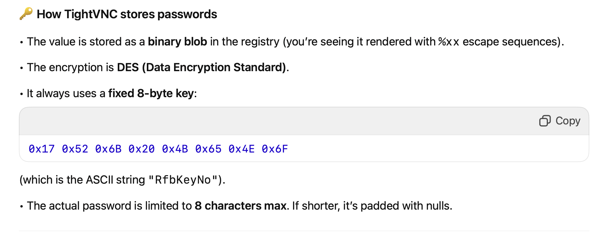
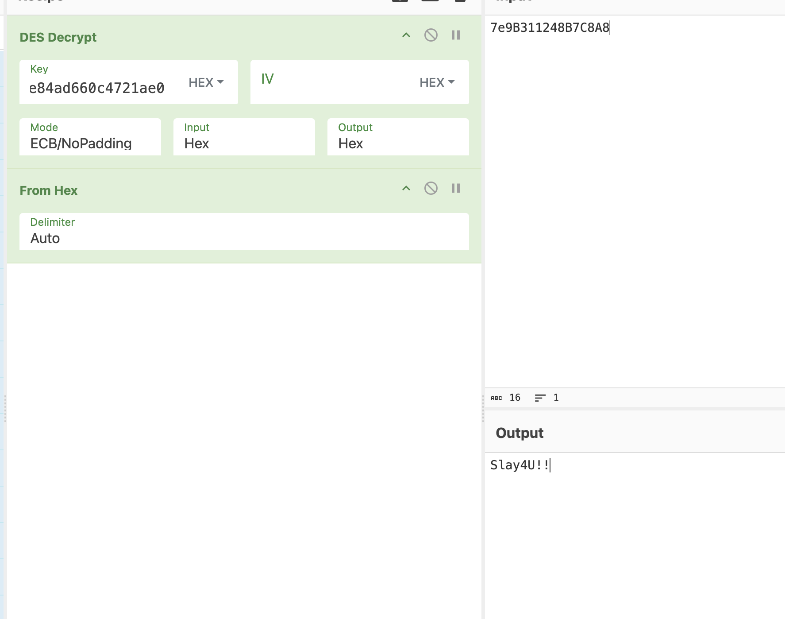

> Description

I installed every old software known to man... The flag is the VNC password, wrapped in ictf{}.


❯ rg -la "VNC"
registry.csv
treeee
rumi/NTUSER.DAT
rumi/Downloads/tightvnc-2.8.85-gpl-setup-64bit.msi
rumi/AppData/Local/Packages/Microsoft.Windows.Search_cw5n1h2txyewy/LocalState/DeviceSearchCache/AppCache134012290447214483.txt
rumi/AppData/Local/Packages/Microsoft.Windows.Search_cw5n1h2txyewy/LocalState/DeviceSearchCache/AppCache134012285660617736.txt
rumi/AppData/Local/Packages/Microsoft.Windows.Search_cw5n1h2txyewy/LocalState/DeviceSearchCache/AppCache134012295836988396.txt
rumi/AppData/Local/Packages/Microsoft.Windows.Search_cw5n1h2txyewy/LocalState/ConstraintIndex/Apps_{f3c414ad-b60c-4030-a670-992bb0491c30}/Apps.index
rumi/AppData/Local/Packages/Microsoft.Windows.Search_cw5n1h2txyewy/LocalState/DeviceSearchCache/AppCache134012242724535881.txt
rumi/AppData/Local/Packages/Microsoft.Windows.Search_cw5n1h2txyewy/LocalState/ConstraintIndex/Apps_{0fc4247e-e371-4b4a-9d04-124c0b372ae1}/Apps.index
rumi/AppData/Local/Packages/Microsoft.Windows.Search_cw5n1h2txyewy/LocalState/DeviceSearchCache/AppCache134012287528488743.txt
rumi/AppData/Local/Packages/Microsoft.Windows.Search_cw5n1h2txyewy/LocalState/DeviceSearchCache/AppCache134012295475264835.txt
rumi/AppData/Local/Packages/Microsoft.Windows.Search_cw5n1h2txyewy/LocalState/DeviceSearchCache/AppCache134012287827365756.txt
rumi/AppData/Local/Packages/Microsoft.Windows.Search_cw5n1h2txyewy/LocalState/DeviceSearchCache/AppCache134012289648595539.txt
rumi/AppData/Local/Packages/Microsoft.Windows.Search_cw5n1h2txyewy/LocalState/DeviceSearchCache/AppCache134012242979325221.txt
rumi/AppData/Local/Packages/Microsoft.Windows.Search_cw5n1h2txyewy/LocalState/ConstraintIndex/Input_{69a70277-6032-4b06-b4be-eb07790fe1df}/appsglobals.txt
rumi/AppData/Local/Packages/Microsoft.Windows.Search_cw5n1h2txyewy/LocalState/DeviceSearchCache/AppCache134012290747284490.txt
rumi/AppData/Local/Packages/Microsoft.Windows.Search_cw5n1h2txyewy/LocalState/DeviceSearchCache/AppCache134012288805061638.txt
rumi/AppData/Local/Packages/Microsoft.Windows.Search_cw5n1h2txyewy/LocalState/DeviceSearchCache/AppCache134012242038116719.txt
rumi/AppData/Local/Packages/Microsoft.Windows.Search_cw5n1h2txyewy/LocalState/DeviceSearchCache/AppCache134012304695817817.txt
rumi/AppData/Local/Packages/Microsoft.Windows.Search_cw5n1h2txyewy/LocalState/DeviceSearchCache/AppCache134012319644223720.txt
rumi/AppData/Local/Packages/Microsoft.Windows.Search_cw5n1h2txyewy/LocalState/DeviceSearchCache/AppCache134012285943954012.txt
rumi/AppData/Local/Packages/Microsoft.Windows.Search_cw5n1h2txyewy/LocalState/DeviceSearchCache/AppCache134012294585239945.txt
rumi/AppData/Local/Packages/Microsoft.Windows.Search_cw5n1h2txyewy/LocalState/DeviceSearchCache/AppCache134012304911178540.txt
rumi/AppData/Local/Packages/Microsoft.Windows.Search_cw5n1h2txyewy/LocalState/DeviceSearchCache/AppCache134012241965434665.txt
rumi/AppData/Local/Packages/Microsoft.Windows.Search_cw5n1h2txyewy/LocalState/DeviceSearchCache/AppCache134012289104817265.txt
rumi/AppData/Local/Packages/Microsoft.Windows.Search_cw5n1h2txyewy/LocalState/DeviceSearchCache/AppCache134012300887293379.txt
rumi/AppData/Local/Packages/Microsoft.Windows.Search_cw5n1h2txyewy/LocalState/DeviceSearchCache/AppCache134012288128711169.txt
rumi/AppData/Local/Packages/Microsoft.Windows.Search_cw5n1h2txyewy/LocalState/DeviceSearchCache/AppCache134012226916202316.txt
rumi/AppData/Local/Packages/Microsoft.Windows.Search_cw5n1h2txyewy/LocalState/DeviceSearchCache/AppCache134012291047694606.txt
rumi/AppData/Local/Packages/Microsoft.Windows.Search_cw5n1h2txyewy/LocalState/DeviceSearchCache/AppCache134012293806908060.txt
rumi/AppData/Local/Packages/Microsoft.Windows.Search_cw5n1h2txyewy/LocalState/DeviceSearchCache/AppCache134012294716263629.txt
rumi/AppData/Local/Packages/Microsoft.Windows.Search_cw5n1h2txyewy/LocalState/DeviceSearchCache/AppCache134012306597382943.txt
rumi/AppData/Local/Packages/Microsoft.Windows.Search_cw5n1h2txyewy/LocalState/DeviceSearchCache/AppCache134012288441656551.txt
rumi/AppData/Local/Packages/Microsoft.Windows.Search_cw5n1h2txyewy/LocalState/DeviceSearchCache/AppCache134012293506396014.txt


https://www.kali.org/tools/reglookup/
reglookup NTUSER.DAT > ../registry.csv

❯ rg "VNC" registry.csv | rg -i "password"
/Software/TightVNC/Server/Password,BINARY,~%9B1%12H%B7%C8%A8,



https://superuser.com/questions/289955/access-windows-registry-from-ubuntu

```js
function my_decode(val){
  var out = []
  val.match(/%..|./g,'').forEach(function(v){
    var hex = v[0]=='%' ? v.substr(1) : v.charCodeAt(0).toString(16)
    out.push(hex)
  })
  return out.join('')
}
```

-> `7e9B311248B7C8A8`

In [1]: bytes.fromhex("e84ad660c4721ae0")
Out[1]: b'\xe8J\xd6`\xc4r\x1a\xe0'

According to chatGPT <https://tenaka.gitbook.io/pentesting/useful-commands/password-cracking/vnc-decrypt-password?utm_source=chatgpt.com>

❯ echo -n "7E9B311248B7C8A8" | xxd -r -p | openssl enc -des-cbc -nopad -nosalt -K e84ad660c4721ae0 -iv 0000000000000000 -d | hexdump -Cv
Error setting cipher DES-CBC
00DF830A02000000:error:0308010C:digital envelope routines:inner_evp_generic_fetch:unsupported:crypto/evp/evp_fetch.c:355:Global default library context, Algorithm (DES-CBC : 15), Properties ()



ictf{Slay4U!!}