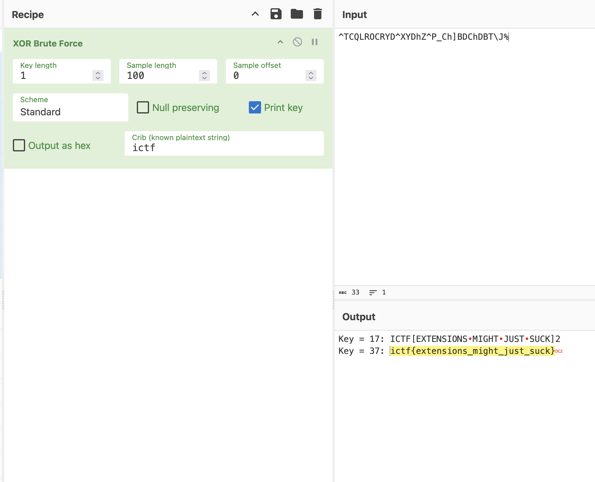

❯ strings chal.pcapng | rg http:// | sort -u
-http://cdp.geotrust.com/GeoTrustECCCA2018.crl0u
-http://ocsp.globalsign.com/gsgccr3dvtlsca20200V
,http://crl.rootg2.amazontrust.com/rootg2.crl0
,http://crt.rootg2.amazontrust.com/rootg2.cer0=
:http://crl3.digicert.com/DigiCertTLSRSASHA2562020CA1-4.crl0@
:http://crl4.digicert.com/DigiCertTLSRSASHA2562020CA1-4.crl0
:http://secure.globalsign.com/cacert/gsgccr3dvtlsca2020.crt09
!http://ocsp.r2m02.amazontrust.com06
!http://ocsp.r2m03.amazontrust.com06
!http://ocsp.r2m04.amazontrust.com06
.http://cdp.geotrust.com/GeoTrustTLSRSACAG1.crl0v
.http://crl.rootca1.amazontrust.com/rootca1.crl0
.http://crt.rootca1.amazontrust.com/rootca1.cer0?
"http://ocsp.rootg2.amazontrust.com08
"http://ocsp2.globalsign.com/rootr30;
*http://crl.r2m02.amazontrust.com/r2m02.crl0u
*http://crl.r2m03.amazontrust.com/r2m03.crl0u
*http://crl.r2m04.amazontrust.com/r2m04.crl0u
*http://crt.r2m02.amazontrust.com/r2m02.cer0

*http://crt.r2m03.amazontrust.com/r2m03.cer0

*http://crt.r2m04.amazontrust.com/r2m04.cer0

/http://secure.globalsign.com/cacert/root-r3.crt06
#http://ocsp.rootca1.amazontrust.com0:
%http://crl.globalsign.com/root-r3.crl0G
=http://cacerts.digicert.com/DigiCertTLSRSASHA2562020CA1-1.crt0

0http://crl.globalsign.com/gsgccr3dvtlsca2020.crl0#
1http://cacerts.geotrust.com/GeoTrustECCCA2018.crt0

1http://crl3.digicert.com/DigiCertGlobalRootCA.crl0=
1http://crl3.digicert.com/DigiCertGlobalRootG2.crl0=
2http://cacerts.geotrust.com/GeoTrustTLSRSACAG1.crt0

4http://cacerts.digicert.com/DigiCertGlobalRootCA.crt0B
4http://cacerts.digicert.com/DigiCertGlobalRootG2.crt0B
Bhttp://crl3.digicert.com/DigiCertGlobalG2TLSRSASHA2562020CA1-1.crl0H
Bhttp://crl4.digicert.com/DigiCertGlobalG2TLSRSASHA2562020CA1-1.crl0
Ehttp://cacerts.digicert.com/DigiCertGlobalG2TLSRSASHA2562020CA1-1.crt0

http://ocsp.digicert.com0@
http://ocsp.digicert.com0B
http://ocsp.digicert.com0I
http://ocsp.digicert.com0Q
http://r11.c.lencr.org/72.crl0
http://r11.i.lencr.org/0{
http://status.geotrust.com0=
http://status.geotrust.com0>
http://www.digicert.com/CPS0
http://x1.c.lencr.org/0
http://x1.i.lencr.org/0
Origin: http://localhost
Referer: http://localhost/

do "http.referrer contains "localhost"" in wireshark

❯ tshark -r chal.pcapng -Y "http && ip.dst == 192.9.137.137" | rg -o "=([a-f0-9]+)" -r '$1' | tr -d "\n"
5e5443514c524f435259445e585944685a5e505f43685d424443684442545c4a%  

